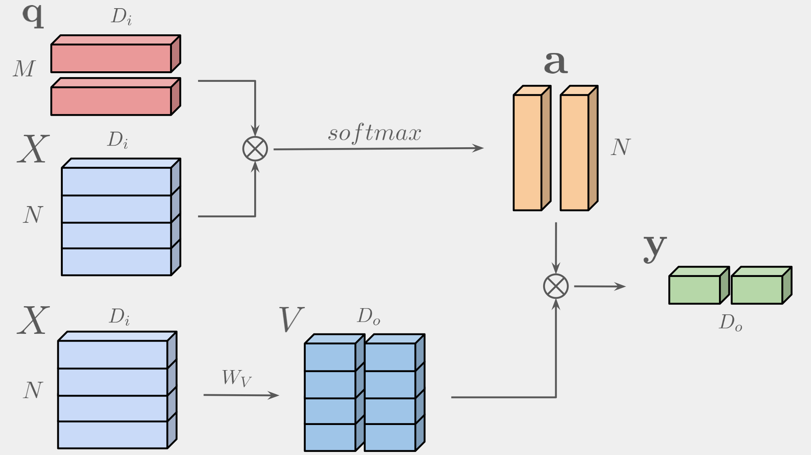

# Attention, Please! Revisiting Attentive Probing Through the Lens of Efficiency

Official PyTorch implementation and pretrained attentive heads for Efficient Probing. [[`arXiv`](https://arxiv.org/pdf/2506.10178)]

**TL;DR:** We introduce efficient probing (EP), a lightweight multi-query cross-attention mechanism that improves accuracy of frozen pretrained models while yielding more interpretable attention maps.

<p align="center">

</p>

## Overview

As fine-tuning becomes increasingly impractical at scale, probing is emerging as the preferred evaluation protocol. Yet, the standard linear probing fails to adequately reflect the potential of models whose pre-training optimizes representations of patch tokens rather than an explicit global representation. This motivates the need for attentive probing, an alternative that uses attention to selectively aggregate patch-level features. Despite its growing adoption, attentive probing remains under-explored, with existing methods suffering from excessive parameterization and poor computational efficiency. 

In this work, we revisit attentive probing through the lens of the accuracy vs. parameter efficiency trade-off. We present the first comprehensive study of existing methods, analyzing their design choices and benchmarking their performance. Building on this, we propose efficient probing (EP), a simple yet effective multi-query cross-attention mechanism that eliminates redundant projections and reduces the number of trainable parameters. Despite its simplicity, EP outperforms linear probing and prior attentive probing approaches across seven benchmarks, generalizes well to diverse pre-training paradigms, and delivers strong low-shot and layer-wise gains. Beyond evaluation, our analysis uncovers emerging properties of EP, such as complementary attention maps, which open new directions for leveraging probing beyond protocol design.

## Emerging Properties

We jointly visualize the attention maps of EP<sub>8</sub>. An emerging property of EP is that its queries specialize in different object regions, yielding complementary and interpretable attention patterns. Queries consistently attend to distinct parts, producing stable semantic correspondences (e.g., tails, beaks, feet) across images and a structured decomposition of visual cues.

<p align="center">

</p>

## Environment

Dependencies are listed in `requirements.txt`.

## Integration (drop-in EP)

Use Efficient Probing (EP) as a lightweight attentive pooling over patch tokens from a frozen backbone (e.g., ViT). EP learns a small set of queries, attends to tokens with a single key projection, uses identity values (no V/O projections), and averages per-query outputs into one descriptor. It returns both the pooled descriptor and interpretable attention maps.

```python
from poolings.ep import EfficientProbing
# ---- Minimal integration example ----
# In your model.__init__:
   self.ep = EfficientProbing(dim=embed_dim, num_queries=32)  # EP_32

# In your model.forward(...):
#  'tokens' are the outputs of a FROZEN backbone (e.g., ViT):
#  shape (B, 1+N, D) if a [CLS] token exists, else (B, N, D)
#
#  Use only patch tokens (default in our paper/code):
   patch_tokens = tokens[:, 1:, :]          # or 'tokens' if you have no [CLS]
#
#  Optional: include [CLS] among the values by passing all tokens:
#  patch_tokens = tokens                    # uncomment to include [CLS]
#
   pooled = self.ep(patch_tokens)           # pooled: (B, D)
   logits = self.head(pooled)               # your classifier head
```

Notes
	•	Freeze the backbone; train only `EfficientProbing` and your classification head.
	•	`num_queries` controls speed/accuracy (e.g., 8, 16, 32). EP averages across queries, so the output stays (B, D).
	•	Inputs & shapes: tokens are (B, N, D) or (B, 1+N, D) if a [CLS] token exists.
	•	Default usage: pass patch tokens only (tokens[:, 1:, :] when [CLS] is present).
	•	To include [CLS] among values, pass all tokens instead.
	•	Outputs: pooled is (B, D) for your head; (optional) attn is (B, Q, N) for visualization/analysis.
	•	Repro tip: set seeds to make the learned query initialization reproducible.

## Experiments

### Evaluating MAE ViT-B with Efficient Probing on ImageNet-1k:

```bash
torchrun --nproc_per_node=4 --nnodes=1 \
    main_linprobe.py --amp bfloat16 --num_workers=12 --dataloader_affinity_hack \
    --epochs=90 --accum_iter=1 --optimizer=lars --batch_size=1024 \
    --model vit_base_patch16  --finetune vit_base_patch16_224.mae \
    --dataset_name imagenet1k --nb_classes 1000 --data_path /mnt/data/Public_datasets/imagenet/imagenet_pytorch \
    --output_dir /home/psomava1/code/beyond_cls/outputs/linprobe_mae_vitb_ep_imagenet1k \
    --cls_features=ep
```

- To perform standard linear probing (**LP**):
  - Use `--cls_features cls` to utilize the class token from the pre-trained model.
  - Use `--cls_features pos` to utilize the patch tokens (via global average pooling).

- To perform full finetuning (**FT**), use the `--finetuning` flag.

#### 🎯 **More poolings, Please!**
- Supported attentive pooling methods (as described in the paper): `abmilp`, `simpool`, `clip`, `siglip`, `aim`, `ep`, `cbam`, `coca`, `cait`, `dinovit`, `jepa`, `dolg`, `cae`
  - These can be passed via the `--cls_features` argument.
  - Note: Appending the suffix `_all` to any pooling type (e.g., `ep_all`) will include both patch tokens and the class token as input to the selected attentive pooling. By default, only patch tokens are used.

#### :globe_with_meridians: **More datasets, Please!**
- Experiment with more datasets in any setup of your choice by adjusting the `--dataset_name`, `--nb_classes`, and `--data_path` arguments accordingly.
  - **Supported datasets**: *ImageNet-1k*, *Places365*, *CIFAR-100*, *StanfordCars*, *Food101*, *FGVCAircraft*, *SUN397*, *DTD*, *OxfordIIITPet*, *CUB200*

####  🛠️ **More models, Please!**
- Try [CAPI](https://github.com/facebookresearch/capi/tree/main) and [DINOv2](https://github.com/facebookresearch/dinov2) pre-trained models (from PyTorch Hub) by adjusting the `--model` argument based on their official repositories.  
  - The `--finetune` argument is **not needed** in this case.

- Try **SimMIM**, **BEiTv2**, and **iBOT** by passing the checkpoint path to the `--finetune` argument.  
  - Pretrained weights are provided via [Google Drive](#).

- Instructions on how to use pre-trained models from **OpenCLIP** are provided in the following subsection.

### Evaluating CLIP ViT-L (pre-trained by openai) with Efficient Probing on ImageNet-1k:

```bash
torchrun --nproc_per_node=4 --nnodes=1 \
    main_linprobe.py --amp bfloat16 --num_workers=12 --dataloader_affinity_hack \
    --epochs=90 --accum_iter=1 --optimizer=lars --batch_size=1024 \
    --model ViT-L-14 --openclip_pretrain openai --openclip \
    --dataset_name imagenet1k --nb_classes 1000 --data_path /mnt/data/Public_datasets/imagenet/imagenet_pytorch \
    --output_dir /home/psomava1/code/beyond_cls/outputs/linprobe_clip_openai_vitl_ep_imagenet1k \
    --cls_features=ep
```
- To evaluate alternative pre-trained OpenCLIP models, adjust the `--model` and `--openclip_pretrain` arguments accordingly. Available combinations can be found in the [official OpenCLIP repository](https://github.com/mlfoundations/open_clip).

    Example alternative:
    
    ```bash
    --model ViT-L-16-SigLIP-256 --openclip_pretrain webli --openclip
    ```

## Acknowledgments

This codebase is based on the official [MAE](https://github.com/facebookresearch/mae), [SimMIM](https://github.com/microsoft/SimMIM/tree/main) and [Beyond [cls]](https://github.com/gmum/beyond_cls) implementations.

We thank the authors for open-sourcing them.

## License
This repository is released under the Apache 2.0 license as found in the [LICENSE](LICENSE) file.


## Citation

If you find this repository useful, please consider giving a star 🌟 and citation:
```
@misc{psomas2025attentionpleaserevisitingattentive,
      title={Attention, Please! Revisiting Attentive Probing Through the Lens of Efficiency}, 
      author={Bill Psomas and Dionysis Christopoulos and Eirini Baltzi and Ioannis Kakogeorgiou and Tilemachos Aravanis and Nikos Komodakis and Konstantinos Karantzalos and Yannis Avrithis and Giorgos Tolias},
      year={2025},
      eprint={2506.10178},
      archivePrefix={arXiv},
      primaryClass={cs.CV},
      url={https://arxiv.org/abs/2506.10178}, 
}
```
