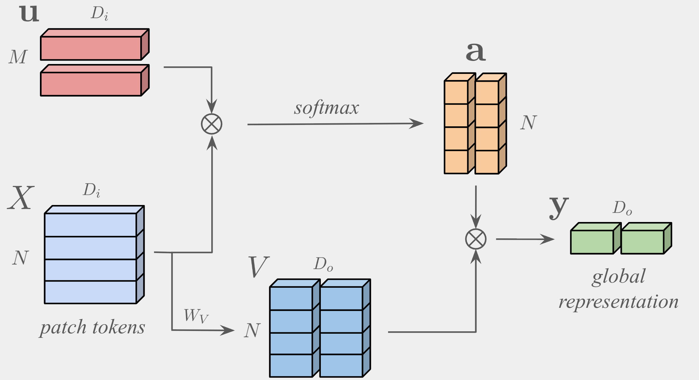

<div align="center">
<h1>⏱️ Probing Frozen Encoders</h1>

**A standing ImageNet-1k benchmark: k-NN, linear and efficient probing across pre-trained encoders.**

**Bill Psomas<sup>1</sup>†, Dionysis Christopoulos<sup>2</sup>†, Eirini Baltzi<sup>2</sup>, Ioannis Kakogeorgiou<sup>6</sup>**  
**Tilemachos Aravanis<sup>1</sup>, Nikos Komodakis<sup>3,4,5</sup>, Konstantinos Karantzalos<sup>2</sup>, Yannis Avrithis, Giorgos Tolias<sup>1</sup>**

<sup>1</sup>Visual Recognition Group, FEE, Czech Technical University in Prague <sup>2</sup>National Technical University of Athens
<sup>3</sup>University of Crete <sup>4</sup>Archimedes, Athena RC <sup>5</sup>ACM-FORTH <sup>6</sup>IIT, NCSR “Demokritos”

[](https://vrg.fel.cvut.cz/ep/)
[](https://huggingface.co/papers/2506.10178)
[](https://arxiv.org/abs/2506.10178)
[](https://openreview.net/pdf?id=PXo0gtT7Al)
[](LICENSE)
[](#)

</div>

This repository is the official PyTorch implementation of **"Attention, Please! Revisiting
Attentive Probing Through the Lens of Efficiency"** (ICLR 2026), and has since grown into a
standing benchmark that goes well beyond the paper's tables.

**The paper** introduces efficient probing (EP), a lightweight multi-query cross-attention
mechanism that improves the accuracy of frozen pre-trained encoders while yielding interpretable
attention maps.

**The benchmark** evaluates frozen encoders three ways on ImageNet-1k &mdash; k-NN (nothing
trained), linear probing (a linear layer), and EP (a linear layer plus learned aggregation)
&mdash; so the gap between them separates *how good the features are* from *how much the
aggregation matters*. Every row links the logs it came from and the exact command that produced
it, and [new backbones are welcome](#contributing-a-row).

<p align="center">

</p>

## Overview

As fine-tuning becomes impractical at scale, probing is emerging as the preferred evaluation protocol. However, standard linear probing can understate the capability of models whose pre-training optimizes local representations rather than an explicit global representation. This motivates attentive probing, an alternative that uses attention to selectively aggregate patch-level features. Despite growing adoption, attentive probing is still underexplored: existing approaches are often over-parameterized and computationally inefficient. 

In this work, we revisit attentive probing through the lens of the accuracy vs. parameter-efficiency trade-off. We present the first comprehensive study of existing methods, analyzing their design choices and benchmarking their performance. Building on these insights, we propose efficient probing (EP), a lightweight yet effective multi-query cross-attention mechanism that eliminates redundant projections and reduces the number of trainable parameters. Across multiple benchmarks and pre-training paradigms, EP consistently outperforms linear probing and previous attentive probing methods, and remains effective when combined with parameter-efficient fine-tuning. Beyond evaluation, our analysis uncovers emerging properties of EP, including complementary attention maps, which open new directions for leveraging probing beyond protocol design.

## Benchmark

Top-1 accuracy of three ways to read a frozen encoder: **k-NN** (nothing trained), **LP**
(a linear layer) and **EP** (a linear layer plus learned aggregation).

**Every row is evaluated on ImageNet-1k** — probes are trained on the train split and scored on
the validation split. The *Pre-training* column is a different thing: it says what data the frozen
backbone was pre-trained on, which is where the rows differ.

The code itself is not limited to ImageNet. `--dataset_name` also accepts `places365`, `CIFAR100`,
`stl10`, `StanfordCars`, `Food101`, `FGVCAircraft`, `SUN397`, `DTD`, `OxfordIIITPet` and `CUB200`,
and the paper reports several of them. The benchmark below stays on ImageNet-1k so that every row
is comparable against every other.

This table is meant to grow. If you evaluate a backbone we have not covered, please open a pull request adding a row — see [Contributing a row](#contributing-a-row).

<!-- LEADERBOARD:START -->
<!-- generated by tools/gen_leaderboard.py from results.csv - do not edit by hand -->

Sorted by **EP**. Ties broken by LP.

| # | Family | Method | Arch. | Pre-training | Image size | k-NN | LP | EP | EP head |
|---:|---|---|---|---|---:|---:|---:|---:|:-:|
| 1 | Hybrid | DINOv3 | ViT-7B/16 | LVD-1689M | 224 | [84.2](logs/dinov3_vit7b/knn.txt) | [88.0](logs/dinov3_vit7b/lp.txt) | **[88.4](logs/dinov3_vit7b/ep.txt)**<sup>&dagger;</sup> | [peak](https://huggingface.co/billpsomas/efficient-probing-heads/blob/main/dinov3_vit7b/ep_head.pth) |
| 2 | VLM | MetaCLIP2 | ViT-bigG/14-378 | MetaCLIP2-worldwide (300+ langs) | 378 | [80.6](logs/metaclip2_bigg378/knn.txt) | [88.1](logs/metaclip2_bigg378/lp.txt) | [88.1](logs/metaclip2_bigg378/ep.txt) | [peak](https://huggingface.co/billpsomas/efficient-probing-heads/blob/main/metaclip2_bigg378/ep_head.pth) |
| 3 | VLM | EVA02-CLIP | E-14-plus | LAION-2B (9B seen) | 224 | [82.9](logs/eva02_e14_plus/knn.txt) | [87.8](logs/eva02_e14_plus/lp.txt) | **[88.0](logs/eva02_e14_plus/ep.txt)** | [peak](https://huggingface.co/billpsomas/efficient-probing-heads/blob/main/eva02_e14_plus/ep_head.pth) |
| 4 | VLM | EVA02-CLIP | E-14 | LAION-2B (4B seen) | 224 | [82.2](logs/eva02_e14/knn.txt) | [87.4](logs/eva02_e14/lp.txt) | **[87.7](logs/eva02_e14/ep.txt)** | [peak](https://huggingface.co/billpsomas/efficient-probing-heads/blob/main/eva02_e14/ep_head.pth) |
| 5 | VLM | SigLIP2 | SO400M/14 | WebLI (10B imgs, 109 langs) | 224 | [77.5](logs/siglip2_so400m/knn.txt)<sup>&sect;</sup> | [86.3](logs/siglip2_so400m/lp.txt)<sup>&sect;</sup> | **[87.7](logs/siglip2_so400m/ep.txt)** | [final](https://huggingface.co/billpsomas/efficient-probing-heads/blob/main/siglip2_so400m/ep_head.pth) |
| 6 | VLM | PE-Core | L-14/336 | MetaCLIP-curated 5.4B | 336 | [49.1](logs/pe_core_l336/knn.txt)<sup>&sect;</sup> | [85.4](logs/pe_core_l336/lp.txt)<sup>&sect;</sup> | **[87.2](logs/pe_core_l336/ep.txt)** | [peak](https://huggingface.co/billpsomas/efficient-probing-heads/blob/main/pe_core_l336/ep_head.pth) |
| 7 | VLM | MetaCLIP2 | ViT-bigG/14 | MetaCLIP2-worldwide (300+ langs) | 224 | [79.6](logs/metaclip2_bigg/knn.txt) | [87.1](logs/metaclip2_bigg/lp.txt) | [87.1](logs/metaclip2_bigg/ep.txt) | [peak](https://huggingface.co/billpsomas/efficient-probing-heads/blob/main/metaclip2_bigg/ep_head.pth) |
| 8 | VLM | SigLIP2 | ViT-L/16 | WebLI (10B imgs, 109 langs) | 256 | [76.2](logs/siglip2_vitl/knn.txt)<sup>&sect;</sup> | [85.3](logs/siglip2_vitl/lp.txt)<sup>&sect;</sup> | **[87.1](logs/siglip2_vitl/ep.txt)** | [peak](https://huggingface.co/billpsomas/efficient-probing-heads/blob/main/siglip2_vitl/ep_head.pth) |
| 9 | Hybrid | DINOv3 | ViT-L/16 | LVD-1689M | 224 | [83.4](logs/dinov3_vitl/knn.txt) | [86.6](logs/dinov3_vitl/lp.txt) | **[87.0](logs/dinov3_vitl/ep.txt)**<sup>&dagger;</sup> | [final](https://huggingface.co/billpsomas/efficient-probing-heads/blob/main/dinov3_vitl/ep_head.pth) |
| 10 | GEN | AIMv2 | ViT-L/14 | DFN-2B + COYO + HQITP | 224 | [76.0](logs/aimv2_vitl/knn.txt)<sup>&Dagger;</sup> | [84.7](logs/aimv2_vitl/lp.txt)<sup>&Dagger;</sup> | **[85.9](logs/aimv2_vitl/ep.txt)** | [final](https://huggingface.co/billpsomas/efficient-probing-heads/blob/main/aimv2_vitl/ep_head.pth) |
| 11 | VLM | SigLIP | ViT-L/16 | WebLI (10B imgs, 109 langs) | 256 | [72.9](logs/siglip_vitl/knn.txt)<sup>&sect;</sup> | [84.2](logs/siglip_vitl/lp.txt)<sup>&sect;</sup> | **[85.9](logs/siglip_vitl/ep.txt)** | [peak](https://huggingface.co/billpsomas/efficient-probing-heads/blob/main/siglip_vitl/ep_head.pth) |
| 12 | Hybrid | DINOv2 | ViT-L/14 | LVD-142M | 224 | [81.0](logs/dinov2_vitl/knn.txt) | [85.2](logs/dinov2_vitl/lp.txt) | **[85.6](logs/dinov2_vitl/ep.txt)**<sup>&dagger;</sup> | [peak](https://huggingface.co/billpsomas/efficient-probing-heads/blob/main/dinov2_vitl/ep_head.pth) |
| 13 | Hybrid | Franca | ViT-L/14 | LAION-600M | 224 | [78.0](logs/franca_laion/knn.txt) | [83.6](logs/franca_laion/lp.txt) | **[84.3](logs/franca_laion/ep_all.txt)**<sup>&dagger;</sup> | [peak](https://huggingface.co/billpsomas/efficient-probing-heads/blob/main/franca_laion/ep_head.pth) |
| 14 | Hybrid | DINOv3 | ViT-B/16 | LVD-1689M | 224 | [79.6](logs/dinov3_vitb/knn.txt) | [83.9](logs/dinov3_vitb/lp.txt) | **[84.1](logs/dinov3_vitb/ep.txt)**<sup>&dagger;</sup> | [final](https://huggingface.co/billpsomas/efficient-probing-heads/blob/main/dinov3_vitb/ep_head.pth) |
| 15 | Hybrid | DINOv2 | ViT-B/14 | LVD-142M | 224 | [79.3](logs/dinov2_vitb/knn.txt) | [83.5](logs/dinov2_vitb/lp.txt) | **[84.0](logs/dinov2_vitb/ep.txt)** | [final](https://huggingface.co/billpsomas/efficient-probing-heads/blob/main/dinov2_vitb/ep_head.pth) |
| 16 | Hybrid | RADIO | ViT-L/16 | distilled (DFN5B/SigLIP/DINOv2/SAM) | 224 | [78.2](logs/radio_v25_l/knn.txt) | **[84.4](logs/radio_v25_l/lp.txt)** | [83.9](logs/radio_v25_l/ep.txt) | [final](https://huggingface.co/billpsomas/efficient-probing-heads/blob/main/radio_v25_l/ep_head.pth) |
| 17 | MIM | EVA02 | ViT-L/14 | IN-22K | 224 | [74.0](logs/eva02_vitl_mim/knn.txt) | [82.8](logs/eva02_vitl_mim/lp.txt) | **[83.6](logs/eva02_vitl_mim/ep.txt)** | [final](https://huggingface.co/billpsomas/efficient-probing-heads/blob/main/eva02_vitl_mim/ep_head.pth) |
| 18 | VLM | CLIP | ViT-L/14 | WIT-400M | 224 | [73.5](logs/clip_vitl/knn.txt) | [82.5](logs/clip_vitl/lp.txt) | **[83.2](logs/clip_vitl/ep.txt)** | [peak](https://huggingface.co/billpsomas/efficient-probing-heads/blob/main/clip_vitl/ep_head.pth) |
| 19 | MIM | CAPI | ViT-L/14 | IN-1K | 224 | [72.9](logs/capi_vitl/knn.txt) | [81.9](logs/capi_vitl/lp.txt) | **[83.0](logs/capi_vitl/ep.txt)** | [final](https://huggingface.co/billpsomas/efficient-probing-heads/blob/main/capi_vitl/ep_head.pth) |
| 20 | MIM | BEiTv2 | ViT-B/16 | IN-1K | 224 | [70.1](logs/beitv2_vitb/knn.txt) | [79.0](logs/beitv2_vitb/lp.txt) | **[81.4](logs/beitv2_vitb/ep.txt)** | [final](https://huggingface.co/billpsomas/efficient-probing-heads/blob/main/beitv2_vitb/ep_head.pth) |
| 21 | Hybrid | RADIO | ViT-B/16 | distilled (DFN5B/SigLIP/DINOv2/SAM) | 224 | [70.4](logs/radio_v25_b/knn.txt) | [79.7](logs/radio_v25_b/lp.txt) | **[80.3](logs/radio_v25_b/ep.txt)** | [final](https://huggingface.co/billpsomas/efficient-probing-heads/blob/main/radio_v25_b/ep_head.pth) |
| 22 | Hybrid | iBOT | ViT-L/16 | IN-1K | 224 | [73.9](logs/ibot_vitl/knn.txt) | **[80.5](logs/ibot_vitl/lp.txt)** | [80.0](logs/ibot_vitl/ep.txt)<sup>&dagger;</sup> | [final](https://huggingface.co/billpsomas/efficient-probing-heads/blob/main/ibot_vitl/ep_head.pth) |
| 23 | MIM | Hiera | ViT-H/16 | IN-1K | 224 | [34.7](logs/hiera_huge/knn.txt)<sup>&Dagger;</sup> | [77.3](logs/hiera_huge/lp.txt)<sup>&Dagger;</sup> | **[79.9](logs/hiera_huge/ep.txt)** | [final](https://huggingface.co/billpsomas/efficient-probing-heads/blob/main/hiera_huge/ep_head.pth) |
| 24 | MIM | MAE | ViT-L/16 | IN-1K | 224 | [48.1](logs/mae_vitl/knn.txt) | [76.0](logs/mae_vitl/lp.txt) | **[79.5](logs/mae_vitl/ep.txt)** | [final](https://huggingface.co/billpsomas/efficient-probing-heads/blob/main/mae_vitl/ep_head.pth) |
| 25 | JEA | I-JEPA | ViT-H/14 | IN-1K | 224 | [68.1](logs/ijepa_vith/knn.txt)<sup>&Dagger;</sup> | [78.1](logs/ijepa_vith/lp.txt)<sup>&Dagger;</sup> | **[79.0](logs/ijepa_vith/ep.txt)** | [final](https://huggingface.co/billpsomas/efficient-probing-heads/blob/main/ijepa_vith/ep_head.pth) |
| 26 | Hybrid | iBOT | ViT-B/16 | IN-1K | 224 | [73.6](logs/ibot_vitb/knn.txt) | [78.7](logs/ibot_vitb/lp.txt) | **[79.0](logs/ibot_vitb/ep.txt)**<sup>&dagger;</sup> | [final](https://huggingface.co/billpsomas/efficient-probing-heads/blob/main/ibot_vitb/ep_head.pth) |
| 27 | MIM | Hiera | ViT-L/16 | IN-1K | 224 | [38.8](logs/hiera_large/knn.txt)<sup>&Dagger;</sup> | [74.1](logs/hiera_large/lp.txt)<sup>&Dagger;</sup> | **[78.5](logs/hiera_large/ep.txt)** | [final](https://huggingface.co/billpsomas/efficient-probing-heads/blob/main/hiera_large/ep_head.pth) |
| 28 | VLM | CLIP | ViT-B/16 | WIT-400M | 224 | [65.7](logs/clip_vitb16/knn.txt) | **[77.9](logs/clip_vitb16/lp.txt)** | [77.8](logs/clip_vitb16/ep.txt)<sup>&dagger;</sup> | [peak](https://huggingface.co/billpsomas/efficient-probing-heads/blob/main/clip_vitb16/ep_head.pth) |
| 29 | JEA | DINO | ViT-B/16 | IN-1K | 224 | [71.6](logs/dino_vitb/knn.txt) | [77.2](logs/dino_vitb/lp.txt) | **[77.4](logs/dino_vitb/ep.txt)**<sup>&dagger;</sup> | [final](https://huggingface.co/billpsomas/efficient-probing-heads/blob/main/dino_vitb/ep_head.pth) |
| 30 | JEA | MoCov3 | ViT-B/16 | IN-1K | 224 | [66.8](logs/mocov3_vitb/knn.txt) | [75.7](logs/mocov3_vitb/lp.txt) | **[76.5](logs/mocov3_vitb/ep.txt)**<sup>&dagger;</sup> | [final](https://huggingface.co/billpsomas/efficient-probing-heads/blob/main/mocov3_vitb/ep_head.pth) |
| 31 | MIM | Hiera | ViT-B/16 | IN-1K | 224 | [39.8](logs/hiera_base/knn.txt)<sup>&Dagger;</sup> | [69.2](logs/hiera_base/lp.txt)<sup>&Dagger;</sup> | **[75.7](logs/hiera_base/ep.txt)** | [final](https://huggingface.co/billpsomas/efficient-probing-heads/blob/main/hiera_base/ep_head.pth) |
| 32 | MIM | MAE | ViT-B/16 | IN-1K | 224 | [35.6](logs/mae_base/knn.txt) | [67.8](logs/mae_base/lp.txt) | **[75.5](logs/mae_base/ep.txt)** | [final](https://huggingface.co/billpsomas/efficient-probing-heads/blob/main/mae_base/ep_head.pth) |
| 33 | MIM | MaskFeat | ViT-B/16 | IN-1K | 224 | [15.9](logs/maskfeat_vitb/knn.txt) | [62.2](logs/maskfeat_vitb/lp.txt) | **[71.8](logs/maskfeat_vitb/ep.txt)** | [final](https://huggingface.co/billpsomas/efficient-probing-heads/blob/main/maskfeat_vitb/ep_head.pth) |
| 34 | MIM | MaskFeat | ViT-L/16 | IN-1K | 224 | [5.7](logs/maskfeat_large/knn.txt) | [40.9](logs/maskfeat_large/lp.txt) | **[69.6](logs/maskfeat_large/ep.txt)** | [final](https://huggingface.co/billpsomas/efficient-probing-heads/blob/main/maskfeat_large/ep_head.pth) |
| 35 | MIM | SimMIM | ViT-B/16 | IN-1K | 224 | [8.6](logs/simmim_vitb/knn.txt) | [47.1](logs/simmim_vitb/lp.txt) | **[64.9](logs/simmim_vitb/ep.txt)** | [final](https://huggingface.co/billpsomas/efficient-probing-heads/blob/main/simmim_vitb/ep_head.pth) |
| 36 | MIM | MAE | ViT-S/16 | IN-1K | 224 | [18.0](logs/mae_vits/knn.txt) | [47.1](logs/mae_vits/lp.txt) | **[64.6](logs/mae_vits/ep.txt)** | [final](https://huggingface.co/billpsomas/efficient-probing-heads/blob/main/mae_vits/ep_head.pth) |
| 37 | GEN | DiT | DiT-XL/2 | IN-1K | 256 | [5.2](logs/dit_xl/knn.txt)<sup>&Dagger;</sup> | [32.7](logs/dit_xl/lp.txt)<sup>&Dagger;</sup> | **[57.0](logs/dit_xl/ep.txt)** | [final](https://huggingface.co/billpsomas/efficient-probing-heads/blob/main/dit_xl/ep_head.pth) |

**Legend.**

<sup>&dagger;</sup> on an EP number marks the 10 rows where EP read the `[CLS]` token **alongside** the patch tokens (`--cls_features ep_all`) rather than the patch tokens alone. This is not a search for the better score — it is used exactly when the encoder's pre-training objective is defined on that token, so dropping it would discard what the model was trained to produce. See the EP note below for the evidence, including the control case where it makes no difference.

Two markers distinguish *why* a row's LP is global average pooling rather than the `[CLS]` token — they are different situations and only one of them is a judgement call:

- <sup>&Dagger;</sup> — the encoder has **no `[CLS]` token at all**, so GAP is the only linear probe available (Hiera, DiT, AIMv2, I-JEPA). Nothing was chosen here.
- <sup>&sect;</sup> — the encoder **does** expose a pooled output, but it is produced by the encoder's own learned attention pooling (SigLIP, SigLIP2, PE-Core). Probing that would measure the pretrained pooler rather than the features, so we use GAP even when it scores lower — see the LP note below.

Paradigms: **MIM** masked image modelling · **JEA** joint-embedding architectures · **Hybrid** MIM + JEA · **VLM** vision-language models · **GEN** generative models.

**Notes.**

- All numbers are top-1 accuracy at the **best epoch**, over a 90-epoch schedule with LARS,
  `--blr 0.1` and effective batch 4096.
- **k-NN** is training-free: features are extracted once, L2-normalised, and val images are
  classified by weighted vote over their neighbours in the train split. We sweep
  *k* &isin; {5…200} and *T* &isin; {0.07, 0.1, 0.2}; the winning pair is in `knn_k`/`knn_T`.
- **LP** reads the `[CLS]` token, or GAP over patch tokens where no usable `[CLS]` exists
  &mdash; marked <sup>&Dagger;</sup> when the encoder has none (Hiera, DiT, AIMv2, I-JEPA) and
  <sup>&sect;</sup> when it has one but produced by its own learned attention pooling (SigLIP,
  SigLIP2, PE-Core). **k-NN reads the same representation as the LP**, so it carries the same marker.
- **EP** reads patch tokens, or patch tokens **plus** the `[CLS]` for encoders whose
  pre-training objective is defined on that token &mdash; marked <sup>&dagger;</sup>.
- Both variant choices follow from **what the encoder was trained to optimise**, never from
  running both and keeping the higher number. See below for the evidence, including the cases
  where the rule costs us.
- **Q**: rows carried over from the paper report the best over a sweep of *Q*; rows we measured
  use **Q = 32 only**, so they are a lower bound. Beating one with a better *Q* is a welcome PR.
- **LP and EP do not always read a feature of the same width.** Each probes the
  representation it is defined on &mdash; LP the encoder's own pooled output, EP the patch
  tokens &mdash; and for 7 rows those differ in size. On the five CLIP-family rows (CLIP
  ViT-L/14, EVA02-CLIP E-14 and E-14-plus, MetaCLIP2 ViT-bigG/14 at both resolutions)
  `--cls_features cls` returns the *projected* embedding, **narrower** than the unprojected
  patch tokens EP pools &mdash; 1280 vs 1664 for MetaCLIP2, 1024 vs 1792 for EVA02-CLIP &mdash;
  so LP is the handicapped arm there. On the two RADIO rows it runs the other way and further:
  `cls_token_per_teacher=True` makes the summary three separate `[CLS]` tokens that LP receives
  concatenated, giving LP a **3&times; wider** feature than EP (3072 vs 1024 for ViT-L/16).
  RADIO ViT-L/16 is one of only two rows where LP beats EP, so that win is not a like-for-like
  comparison and should not be read as one.
- **Image size** is the evaluation resolution and is not constant (256 for SigLIP/SigLIP2/DiT,
  336 for PE-Core, 378 for MetaCLIP2-378), so rows at different resolutions are not exactly
  like-for-like.
- **EP heads are downloadable**: the *EP head* column links each row's trained head on
  [HuggingFace](https://huggingface.co/billpsomas/efficient-probing-heads). *peak* means the
  file is the run's best epoch and reproduces the EP number exactly; *final* means the
  run's last epoch, whose own accuracy is recorded in the file's metadata next to the
  table figure. The split exists because the training code initially kept only a rolling
  per-epoch checkpoint, so finished runs left their final epoch behind; best-epoch saving
  was added later, and the 12 early-peaking models -- where final and best differ most --
  were re-run under identical settings to recapture their peaks. Heads contain no backbone
  weights; each config.json names the encoder.

<details>
<summary><b>Grouped by family</b> (same rows, ordered by paradigm)</summary>

| Family | Method | Arch. | Pre-training | Image size | LP | EP |
|---|---|---|---|---:|---:|---:|
| MIM | EVA02 | ViT-L/14 | IN-22K | 224 | [82.8](logs/eva02_vitl_mim/lp.txt) | **[83.6](logs/eva02_vitl_mim/ep.txt)** |
| MIM | CAPI | ViT-L/14 | IN-1K | 224 | [81.9](logs/capi_vitl/lp.txt) | **[83.0](logs/capi_vitl/ep.txt)** |
| MIM | BEiTv2 | ViT-B/16 | IN-1K | 224 | [79.0](logs/beitv2_vitb/lp.txt) | **[81.4](logs/beitv2_vitb/ep.txt)** |
| MIM | Hiera | ViT-H/16 | IN-1K | 224 | [77.3](logs/hiera_huge/lp.txt)<sup>&Dagger;</sup> | **[79.9](logs/hiera_huge/ep.txt)** |
| MIM | MAE | ViT-L/16 | IN-1K | 224 | [76.0](logs/mae_vitl/lp.txt) | **[79.5](logs/mae_vitl/ep.txt)** |
| MIM | Hiera | ViT-L/16 | IN-1K | 224 | [74.1](logs/hiera_large/lp.txt)<sup>&Dagger;</sup> | **[78.5](logs/hiera_large/ep.txt)** |
| MIM | Hiera | ViT-B/16 | IN-1K | 224 | [69.2](logs/hiera_base/lp.txt)<sup>&Dagger;</sup> | **[75.7](logs/hiera_base/ep.txt)** |
| MIM | MAE | ViT-B/16 | IN-1K | 224 | [67.8](logs/mae_base/lp.txt) | **[75.5](logs/mae_base/ep.txt)** |
| MIM | MaskFeat | ViT-B/16 | IN-1K | 224 | [62.2](logs/maskfeat_vitb/lp.txt) | **[71.8](logs/maskfeat_vitb/ep.txt)** |
| MIM | MaskFeat | ViT-L/16 | IN-1K | 224 | [40.9](logs/maskfeat_large/lp.txt) | **[69.6](logs/maskfeat_large/ep.txt)** |
| MIM | SimMIM | ViT-B/16 | IN-1K | 224 | [47.1](logs/simmim_vitb/lp.txt) | **[64.9](logs/simmim_vitb/ep.txt)** |
| MIM | MAE | ViT-S/16 | IN-1K | 224 | [47.1](logs/mae_vits/lp.txt) | **[64.6](logs/mae_vits/ep.txt)** |
| JEA | I-JEPA | ViT-H/14 | IN-1K | 224 | [78.1](logs/ijepa_vith/lp.txt)<sup>&Dagger;</sup> | **[79.0](logs/ijepa_vith/ep.txt)** |
| JEA | DINO | ViT-B/16 | IN-1K | 224 | [77.2](logs/dino_vitb/lp.txt) | **[77.4](logs/dino_vitb/ep.txt)**<sup>&dagger;</sup> |
| JEA | MoCov3 | ViT-B/16 | IN-1K | 224 | [75.7](logs/mocov3_vitb/lp.txt) | **[76.5](logs/mocov3_vitb/ep.txt)**<sup>&dagger;</sup> |
| Hybrid | DINOv3 | ViT-7B/16 | LVD-1689M | 224 | [88.0](logs/dinov3_vit7b/lp.txt) | **[88.4](logs/dinov3_vit7b/ep.txt)**<sup>&dagger;</sup> |
| Hybrid | DINOv3 | ViT-L/16 | LVD-1689M | 224 | [86.6](logs/dinov3_vitl/lp.txt) | **[87.0](logs/dinov3_vitl/ep.txt)**<sup>&dagger;</sup> |
| Hybrid | DINOv2 | ViT-L/14 | LVD-142M | 224 | [85.2](logs/dinov2_vitl/lp.txt) | **[85.6](logs/dinov2_vitl/ep.txt)**<sup>&dagger;</sup> |
| Hybrid | Franca | ViT-L/14 | LAION-600M | 224 | [83.6](logs/franca_laion/lp.txt) | **[84.3](logs/franca_laion/ep_all.txt)**<sup>&dagger;</sup> |
| Hybrid | DINOv3 | ViT-B/16 | LVD-1689M | 224 | [83.9](logs/dinov3_vitb/lp.txt) | **[84.1](logs/dinov3_vitb/ep.txt)**<sup>&dagger;</sup> |
| Hybrid | DINOv2 | ViT-B/14 | LVD-142M | 224 | [83.5](logs/dinov2_vitb/lp.txt) | **[84.0](logs/dinov2_vitb/ep.txt)** |
| Hybrid | RADIO | ViT-L/16 | distilled (DFN5B/SigLIP/DINOv2/SAM) | 224 | **[84.4](logs/radio_v25_l/lp.txt)** | [83.9](logs/radio_v25_l/ep.txt) |
| Hybrid | RADIO | ViT-B/16 | distilled (DFN5B/SigLIP/DINOv2/SAM) | 224 | [79.7](logs/radio_v25_b/lp.txt) | **[80.3](logs/radio_v25_b/ep.txt)** |
| Hybrid | iBOT | ViT-L/16 | IN-1K | 224 | **[80.5](logs/ibot_vitl/lp.txt)** | [80.0](logs/ibot_vitl/ep.txt)<sup>&dagger;</sup> |
| Hybrid | iBOT | ViT-B/16 | IN-1K | 224 | [78.7](logs/ibot_vitb/lp.txt) | **[79.0](logs/ibot_vitb/ep.txt)**<sup>&dagger;</sup> |
| VLM | MetaCLIP2 | ViT-bigG/14-378 | MetaCLIP2-worldwide (300+ langs) | 378 | [88.1](logs/metaclip2_bigg378/lp.txt) | [88.1](logs/metaclip2_bigg378/ep.txt) |
| VLM | EVA02-CLIP | E-14-plus | LAION-2B (9B seen) | 224 | [87.8](logs/eva02_e14_plus/lp.txt) | **[88.0](logs/eva02_e14_plus/ep.txt)** |
| VLM | EVA02-CLIP | E-14 | LAION-2B (4B seen) | 224 | [87.4](logs/eva02_e14/lp.txt) | **[87.7](logs/eva02_e14/ep.txt)** |
| VLM | SigLIP2 | SO400M/14 | WebLI (10B imgs, 109 langs) | 224 | [86.3](logs/siglip2_so400m/lp.txt)<sup>&sect;</sup> | **[87.7](logs/siglip2_so400m/ep.txt)** |
| VLM | PE-Core | L-14/336 | MetaCLIP-curated 5.4B | 336 | [85.4](logs/pe_core_l336/lp.txt)<sup>&sect;</sup> | **[87.2](logs/pe_core_l336/ep.txt)** |
| VLM | MetaCLIP2 | ViT-bigG/14 | MetaCLIP2-worldwide (300+ langs) | 224 | [87.1](logs/metaclip2_bigg/lp.txt) | [87.1](logs/metaclip2_bigg/ep.txt) |
| VLM | SigLIP2 | ViT-L/16 | WebLI (10B imgs, 109 langs) | 256 | [85.3](logs/siglip2_vitl/lp.txt)<sup>&sect;</sup> | **[87.1](logs/siglip2_vitl/ep.txt)** |
| VLM | SigLIP | ViT-L/16 | WebLI (10B imgs, 109 langs) | 256 | [84.2](logs/siglip_vitl/lp.txt)<sup>&sect;</sup> | **[85.9](logs/siglip_vitl/ep.txt)** |
| VLM | CLIP | ViT-L/14 | WIT-400M | 224 | [82.5](logs/clip_vitl/lp.txt) | **[83.2](logs/clip_vitl/ep.txt)** |
| VLM | CLIP | ViT-B/16 | WIT-400M | 224 | **[77.9](logs/clip_vitb16/lp.txt)** | [77.8](logs/clip_vitb16/ep.txt)<sup>&dagger;</sup> |
| GEN | AIMv2 | ViT-L/14 | DFN-2B + COYO + HQITP | 224 | [84.7](logs/aimv2_vitl/lp.txt)<sup>&Dagger;</sup> | **[85.9](logs/aimv2_vitl/ep.txt)** |
| GEN | DiT | DiT-XL/2 | IN-1K | 256 | [32.7](logs/dit_xl/lp.txt)<sup>&Dagger;</sup> | **[57.0](logs/dit_xl/ep.txt)** |

</details>

<details>
<summary><b>Grouped by backbone scale</b></summary>

| Scale | Family | Method | Arch. | Image size | LP | EP |
|---|---|---|---|---:|---:|---:|
| Small | MIM | MAE | ViT-S/16 | 224 | [47.1](logs/mae_vits/lp.txt) | **[64.6](logs/mae_vits/ep.txt)** |
| Base | Hybrid | DINOv3 | ViT-B/16 | 224 | [83.9](logs/dinov3_vitb/lp.txt) | **[84.1](logs/dinov3_vitb/ep.txt)**<sup>&dagger;</sup> |
| Base | Hybrid | DINOv2 | ViT-B/14 | 224 | [83.5](logs/dinov2_vitb/lp.txt) | **[84.0](logs/dinov2_vitb/ep.txt)** |
| Base | MIM | BEiTv2 | ViT-B/16 | 224 | [79.0](logs/beitv2_vitb/lp.txt) | **[81.4](logs/beitv2_vitb/ep.txt)** |
| Base | Hybrid | RADIO | ViT-B/16 | 224 | [79.7](logs/radio_v25_b/lp.txt) | **[80.3](logs/radio_v25_b/ep.txt)** |
| Base | Hybrid | iBOT | ViT-B/16 | 224 | [78.7](logs/ibot_vitb/lp.txt) | **[79.0](logs/ibot_vitb/ep.txt)**<sup>&dagger;</sup> |
| Base | VLM | CLIP | ViT-B/16 | 224 | **[77.9](logs/clip_vitb16/lp.txt)** | [77.8](logs/clip_vitb16/ep.txt)<sup>&dagger;</sup> |
| Base | JEA | DINO | ViT-B/16 | 224 | [77.2](logs/dino_vitb/lp.txt) | **[77.4](logs/dino_vitb/ep.txt)**<sup>&dagger;</sup> |
| Base | JEA | MoCov3 | ViT-B/16 | 224 | [75.7](logs/mocov3_vitb/lp.txt) | **[76.5](logs/mocov3_vitb/ep.txt)**<sup>&dagger;</sup> |
| Base | MIM | Hiera | ViT-B/16 | 224 | [69.2](logs/hiera_base/lp.txt)<sup>&Dagger;</sup> | **[75.7](logs/hiera_base/ep.txt)** |
| Base | MIM | MAE | ViT-B/16 | 224 | [67.8](logs/mae_base/lp.txt) | **[75.5](logs/mae_base/ep.txt)** |
| Base | MIM | MaskFeat | ViT-B/16 | 224 | [62.2](logs/maskfeat_vitb/lp.txt) | **[71.8](logs/maskfeat_vitb/ep.txt)** |
| Base | MIM | SimMIM | ViT-B/16 | 224 | [47.1](logs/simmim_vitb/lp.txt) | **[64.9](logs/simmim_vitb/ep.txt)** |
| Large | VLM | SigLIP2 | SO400M/14 | 224 | [86.3](logs/siglip2_so400m/lp.txt)<sup>&sect;</sup> | **[87.7](logs/siglip2_so400m/ep.txt)** |
| Large | VLM | SigLIP2 | ViT-L/16 | 256 | [85.3](logs/siglip2_vitl/lp.txt)<sup>&sect;</sup> | **[87.1](logs/siglip2_vitl/ep.txt)** |
| Large | Hybrid | DINOv3 | ViT-L/16 | 224 | [86.6](logs/dinov3_vitl/lp.txt) | **[87.0](logs/dinov3_vitl/ep.txt)**<sup>&dagger;</sup> |
| Large | GEN | AIMv2 | ViT-L/14 | 224 | [84.7](logs/aimv2_vitl/lp.txt)<sup>&Dagger;</sup> | **[85.9](logs/aimv2_vitl/ep.txt)** |
| Large | VLM | SigLIP | ViT-L/16 | 256 | [84.2](logs/siglip_vitl/lp.txt)<sup>&sect;</sup> | **[85.9](logs/siglip_vitl/ep.txt)** |
| Large | Hybrid | DINOv2 | ViT-L/14 | 224 | [85.2](logs/dinov2_vitl/lp.txt) | **[85.6](logs/dinov2_vitl/ep.txt)**<sup>&dagger;</sup> |
| Large | Hybrid | Franca | ViT-L/14 | 224 | [83.6](logs/franca_laion/lp.txt) | **[84.3](logs/franca_laion/ep_all.txt)**<sup>&dagger;</sup> |
| Large | Hybrid | RADIO | ViT-L/16 | 224 | **[84.4](logs/radio_v25_l/lp.txt)** | [83.9](logs/radio_v25_l/ep.txt) |
| Large | MIM | EVA02 | ViT-L/14 | 224 | [82.8](logs/eva02_vitl_mim/lp.txt) | **[83.6](logs/eva02_vitl_mim/ep.txt)** |
| Large | VLM | CLIP | ViT-L/14 | 224 | [82.5](logs/clip_vitl/lp.txt) | **[83.2](logs/clip_vitl/ep.txt)** |
| Large | MIM | CAPI | ViT-L/14 | 224 | [81.9](logs/capi_vitl/lp.txt) | **[83.0](logs/capi_vitl/ep.txt)** |
| Large | Hybrid | iBOT | ViT-L/16 | 224 | **[80.5](logs/ibot_vitl/lp.txt)** | [80.0](logs/ibot_vitl/ep.txt)<sup>&dagger;</sup> |
| Large | MIM | MAE | ViT-L/16 | 224 | [76.0](logs/mae_vitl/lp.txt) | **[79.5](logs/mae_vitl/ep.txt)** |
| Large | MIM | Hiera | ViT-L/16 | 224 | [74.1](logs/hiera_large/lp.txt)<sup>&Dagger;</sup> | **[78.5](logs/hiera_large/ep.txt)** |
| Large | MIM | MaskFeat | ViT-L/16 | 224 | [40.9](logs/maskfeat_large/lp.txt) | **[69.6](logs/maskfeat_large/ep.txt)** |
| Giant | MIM | Hiera | ViT-H/16 | 224 | [77.3](logs/hiera_huge/lp.txt)<sup>&Dagger;</sup> | **[79.9](logs/hiera_huge/ep.txt)** |
| Giant | JEA | I-JEPA | ViT-H/14 | 224 | [78.1](logs/ijepa_vith/lp.txt)<sup>&Dagger;</sup> | **[79.0](logs/ijepa_vith/ep.txt)** |
| Other | Hybrid | DINOv3 | ViT-7B/16 | 224 | [88.0](logs/dinov3_vit7b/lp.txt) | **[88.4](logs/dinov3_vit7b/ep.txt)**<sup>&dagger;</sup> |
| Other | VLM | MetaCLIP2 | ViT-bigG/14-378 | 378 | [88.1](logs/metaclip2_bigg378/lp.txt) | [88.1](logs/metaclip2_bigg378/ep.txt) |
| Other | VLM | EVA02-CLIP | E-14-plus | 224 | [87.8](logs/eva02_e14_plus/lp.txt) | **[88.0](logs/eva02_e14_plus/ep.txt)** |
| Other | VLM | EVA02-CLIP | E-14 | 224 | [87.4](logs/eva02_e14/lp.txt) | **[87.7](logs/eva02_e14/ep.txt)** |
| Other | VLM | PE-Core | L-14/336 | 336 | [85.4](logs/pe_core_l336/lp.txt)<sup>&sect;</sup> | **[87.2](logs/pe_core_l336/ep.txt)** |
| Other | VLM | MetaCLIP2 | ViT-bigG/14 | 224 | [87.1](logs/metaclip2_bigg/lp.txt) | [87.1](logs/metaclip2_bigg/ep.txt) |
| Other | GEN | DiT | DiT-XL/2 | 256 | [32.7](logs/dit_xl/lp.txt)<sup>&Dagger;</sup> | **[57.0](logs/dit_xl/ep.txt)** |

</details>

<details>
<summary><b>Commands</b> — exact settings behind each row</summary>

**DINOv3 ViT-7B/16** — k-NN 84.2, LP 88.0, EP 88.4

```bash
# k-NN  (best was k=200, T=0.1)
torchrun --nproc_per_node=8 main_linprobe.py --knn_eval \
    --T_sweep 0.07,0.1,0.2 --amp bfloat16 \
    --dataset_name imagenet1k --nb_classes 1000 --data_path /path/to/imagenet \
    --model dinov3_vit7b16 --dinov3_weights /path/to/dinov3_weights.pth \
    --cls_features cls

# LP
torchrun --nproc_per_node=8 main_linprobe.py \
    --epochs 90 --optimizer lars --blr 0.1 --batch_size 512 --accum_iter 1 \
    --dataset_name imagenet1k --nb_classes 1000 --data_path /path/to/imagenet \
    --d_out 1 --amp bfloat16 \
    --model dinov3_vit7b16 --dinov3_weights /path/to/dinov3_weights.pth \
    --cls_features cls

# EP
torchrun --nproc_per_node=8 main_linprobe.py \
    --epochs 90 --optimizer lars --blr 0.1 --batch_size 512 --accum_iter 1 \
    --dataset_name imagenet1k --nb_classes 1000 --data_path /path/to/imagenet \
    --d_out 1 --amp bfloat16 \
    --model dinov3_vit7b16 --dinov3_weights /path/to/dinov3_weights.pth \
    --cls_features ep_all --ep_queries 32
```

**MetaCLIP2 ViT-bigG/14-378** — k-NN 80.6, LP 88.1, EP 88.1

```bash
# k-NN  (best was k=15, T=0.07)
torchrun --nproc_per_node=8 main_linprobe.py --knn_eval \
    --T_sweep 0.07,0.1,0.2 --amp bfloat16 \
    --dataset_name imagenet1k --nb_classes 1000 --data_path /path/to/imagenet \
    --model ViT-bigG-14-worldwide-378 --openclip --openclip_pretrain metaclip2_worldwide --input_size 378 \
    --cls_features cls

# LP
torchrun --nproc_per_node=8 main_linprobe.py \
    --epochs 90 --optimizer lars --blr 0.1 --batch_size 512 --accum_iter 1 \
    --dataset_name imagenet1k --nb_classes 1000 --data_path /path/to/imagenet \
    --d_out 1 --amp bfloat16 \
    --model ViT-bigG-14-worldwide-378 --openclip --openclip_pretrain metaclip2_worldwide --input_size 378 \
    --cls_features cls

# EP
torchrun --nproc_per_node=8 main_linprobe.py \
    --epochs 90 --optimizer lars --blr 0.1 --batch_size 512 --accum_iter 1 \
    --dataset_name imagenet1k --nb_classes 1000 --data_path /path/to/imagenet \
    --d_out 1 --amp bfloat16 \
    --model ViT-bigG-14-worldwide-378 --openclip --openclip_pretrain metaclip2_worldwide --input_size 378 \
    --cls_features ep --ep_queries 32
```

**EVA02-CLIP E-14-plus** — k-NN 82.9, LP 87.8, EP 88.0

```bash
# k-NN  (best was k=15, T=0.1)
torchrun --nproc_per_node=8 main_linprobe.py --knn_eval \
    --T_sweep 0.07,0.1,0.2 --amp bfloat16 \
    --dataset_name imagenet1k --nb_classes 1000 --data_path /path/to/imagenet \
    --model EVA02-E-14-plus --openclip --openclip_pretrain laion2b_s9b_b144k \
    --cls_features cls

# LP
torchrun --nproc_per_node=8 main_linprobe.py \
    --epochs 90 --optimizer lars --blr 0.1 --batch_size 512 --accum_iter 1 \
    --dataset_name imagenet1k --nb_classes 1000 --data_path /path/to/imagenet \
    --d_out 1 --amp bfloat16 \
    --model EVA02-E-14-plus --openclip --openclip_pretrain laion2b_s9b_b144k \
    --cls_features cls

# EP
torchrun --nproc_per_node=8 main_linprobe.py \
    --epochs 90 --optimizer lars --blr 0.1 --batch_size 512 --accum_iter 1 \
    --dataset_name imagenet1k --nb_classes 1000 --data_path /path/to/imagenet \
    --d_out 1 --amp bfloat16 \
    --model EVA02-E-14-plus --openclip --openclip_pretrain laion2b_s9b_b144k \
    --cls_features ep --ep_queries 32
```

**EVA02-CLIP E-14** — k-NN 82.2, LP 87.4, EP 87.7

```bash
# k-NN  (best was k=20, T=0.1)
torchrun --nproc_per_node=8 main_linprobe.py --knn_eval \
    --T_sweep 0.07,0.1,0.2 --amp bfloat16 \
    --dataset_name imagenet1k --nb_classes 1000 --data_path /path/to/imagenet \
    --model EVA02-E-14 --openclip --openclip_pretrain laion2b_s4b_b115k \
    --cls_features cls

# LP
torchrun --nproc_per_node=8 main_linprobe.py \
    --epochs 90 --optimizer lars --blr 0.1 --batch_size 512 --accum_iter 1 \
    --dataset_name imagenet1k --nb_classes 1000 --data_path /path/to/imagenet \
    --d_out 1 --amp bfloat16 \
    --model EVA02-E-14 --openclip --openclip_pretrain laion2b_s4b_b115k \
    --cls_features cls

# EP
torchrun --nproc_per_node=8 main_linprobe.py \
    --epochs 90 --optimizer lars --blr 0.1 --batch_size 512 --accum_iter 1 \
    --dataset_name imagenet1k --nb_classes 1000 --data_path /path/to/imagenet \
    --d_out 1 --amp bfloat16 \
    --model EVA02-E-14 --openclip --openclip_pretrain laion2b_s4b_b115k \
    --cls_features ep --ep_queries 32
```

**SigLIP2 SO400M/14** — k-NN 77.5, LP 86.3, EP 87.7

```bash
# k-NN  (best was k=15, T=0.07)
torchrun --nproc_per_node=8 main_linprobe.py --knn_eval \
    --T_sweep 0.07,0.1,0.2 --amp bfloat16 \
    --dataset_name imagenet1k --nb_classes 1000 --data_path /path/to/imagenet \
    --model ViT-SO400M-14-SigLIP2 --openclip --openclip_pretrain webli \
    --cls_features pos

# LP
torchrun --nproc_per_node=8 main_linprobe.py \
    --epochs 90 --optimizer lars --blr 0.1 --batch_size 512 --accum_iter 1 \
    --dataset_name imagenet1k --nb_classes 1000 --data_path /path/to/imagenet \
    --d_out 1 --amp bfloat16 \
    --model ViT-SO400M-14-SigLIP2 --openclip --openclip_pretrain webli \
    --cls_features pos

# EP
torchrun --nproc_per_node=8 main_linprobe.py \
    --epochs 90 --optimizer lars --blr 0.1 --batch_size 512 --accum_iter 1 \
    --dataset_name imagenet1k --nb_classes 1000 --data_path /path/to/imagenet \
    --d_out 1 --amp bfloat16 \
    --model ViT-SO400M-14-SigLIP2 --openclip --openclip_pretrain webli \
    --cls_features ep --ep_queries 32
```

**PE-Core L-14/336** — k-NN 49.1, LP 85.4, EP 87.2

```bash
# k-NN  (best was k=10, T=0.07)
torchrun --nproc_per_node=8 main_linprobe.py --knn_eval \
    --T_sweep 0.07,0.1,0.2 --amp bfloat16 \
    --dataset_name imagenet1k --nb_classes 1000 --data_path /path/to/imagenet \
    --model PE-Core-L-14-336 --openclip --openclip_pretrain meta --input_size 336 \
    --cls_features pos

# LP
torchrun --nproc_per_node=8 main_linprobe.py \
    --epochs 90 --optimizer lars --blr 0.1 --batch_size 512 --accum_iter 1 \
    --dataset_name imagenet1k --nb_classes 1000 --data_path /path/to/imagenet \
    --d_out 1 --amp bfloat16 \
    --model PE-Core-L-14-336 --openclip --openclip_pretrain meta --input_size 336 \
    --cls_features pos

# EP
torchrun --nproc_per_node=8 main_linprobe.py \
    --epochs 90 --optimizer lars --blr 0.1 --batch_size 512 --accum_iter 1 \
    --dataset_name imagenet1k --nb_classes 1000 --data_path /path/to/imagenet \
    --d_out 1 --amp bfloat16 \
    --model PE-Core-L-14-336 --openclip --openclip_pretrain meta --input_size 336 \
    --cls_features ep --ep_queries 32
```

**MetaCLIP2 ViT-bigG/14** — k-NN 79.6, LP 87.1, EP 87.1

```bash
# k-NN  (best was k=15, T=0.1)
torchrun --nproc_per_node=8 main_linprobe.py --knn_eval \
    --T_sweep 0.07,0.1,0.2 --amp bfloat16 \
    --dataset_name imagenet1k --nb_classes 1000 --data_path /path/to/imagenet \
    --model ViT-bigG-14-worldwide --openclip --openclip_pretrain metaclip2_worldwide \
    --cls_features cls

# LP
torchrun --nproc_per_node=8 main_linprobe.py \
    --epochs 90 --optimizer lars --blr 0.1 --batch_size 512 --accum_iter 1 \
    --dataset_name imagenet1k --nb_classes 1000 --data_path /path/to/imagenet \
    --d_out 1 --amp bfloat16 \
    --model ViT-bigG-14-worldwide --openclip --openclip_pretrain metaclip2_worldwide \
    --cls_features cls

# EP
torchrun --nproc_per_node=8 main_linprobe.py \
    --epochs 90 --optimizer lars --blr 0.1 --batch_size 512 --accum_iter 1 \
    --dataset_name imagenet1k --nb_classes 1000 --data_path /path/to/imagenet \
    --d_out 1 --amp bfloat16 \
    --model ViT-bigG-14-worldwide --openclip --openclip_pretrain metaclip2_worldwide \
    --cls_features ep --ep_queries 32
```

**SigLIP2 ViT-L/16** — k-NN 76.2, LP 85.3, EP 87.1

```bash
# k-NN  (best was k=15, T=0.07)
torchrun --nproc_per_node=8 main_linprobe.py --knn_eval \
    --T_sweep 0.07,0.1,0.2 --amp bfloat16 \
    --dataset_name imagenet1k --nb_classes 1000 --data_path /path/to/imagenet \
    --model ViT-L-16-SigLIP2-256 --openclip --openclip_pretrain webli --input_size 256 \
    --cls_features pos

# LP
torchrun --nproc_per_node=8 main_linprobe.py \
    --epochs 90 --optimizer lars --blr 0.1 --batch_size 512 --accum_iter 1 \
    --dataset_name imagenet1k --nb_classes 1000 --data_path /path/to/imagenet \
    --d_out 1 --amp bfloat16 \
    --model ViT-L-16-SigLIP2-256 --openclip --openclip_pretrain webli --input_size 256 \
    --cls_features pos

# EP
torchrun --nproc_per_node=8 main_linprobe.py \
    --epochs 90 --optimizer lars --blr 0.1 --batch_size 512 --accum_iter 1 \
    --dataset_name imagenet1k --nb_classes 1000 --data_path /path/to/imagenet \
    --d_out 1 --amp bfloat16 \
    --model ViT-L-16-SigLIP2-256 --openclip --openclip_pretrain webli --input_size 256 \
    --cls_features ep --ep_queries 32
```

**DINOv3 ViT-L/16** — k-NN 83.4, LP 86.6, EP 87.0

```bash
# k-NN  (best was k=200, T=0.07)
torchrun --nproc_per_node=8 main_linprobe.py --knn_eval \
    --T_sweep 0.07,0.1,0.2 --amp bfloat16 \
    --dataset_name imagenet1k --nb_classes 1000 --data_path /path/to/imagenet \
    --model dinov3_vitl16 --dinov3_weights /path/to/dinov3_weights.pth \
    --cls_features cls

# LP
torchrun --nproc_per_node=8 main_linprobe.py \
    --epochs 90 --optimizer lars --blr 0.1 --batch_size 512 --accum_iter 1 \
    --dataset_name imagenet1k --nb_classes 1000 --data_path /path/to/imagenet \
    --d_out 1 --amp bfloat16 \
    --model dinov3_vitl16 --dinov3_weights /path/to/dinov3_weights.pth \
    --cls_features cls

# EP
torchrun --nproc_per_node=8 main_linprobe.py \
    --epochs 90 --optimizer lars --blr 0.1 --batch_size 512 --accum_iter 1 \
    --dataset_name imagenet1k --nb_classes 1000 --data_path /path/to/imagenet \
    --d_out 1 --amp bfloat16 \
    --model dinov3_vitl16 --dinov3_weights /path/to/dinov3_weights.pth \
    --cls_features ep_all --ep_queries 32
```

**AIMv2 ViT-L/14** — k-NN 76.0, LP 84.7, EP 85.9

```bash
# k-NN  (best was k=10, T=0.2)
torchrun --nproc_per_node=8 main_linprobe.py --knn_eval \
    --T_sweep 0.07,0.1,0.2 --amp bfloat16 \
    --dataset_name imagenet1k --nb_classes 1000 --data_path /path/to/imagenet \
    --model aimv2-large-patch14-224 \
    --cls_features pos

# LP
torchrun --nproc_per_node=8 main_linprobe.py \
    --epochs 90 --optimizer lars --blr 0.1 --batch_size 512 --accum_iter 1 \
    --dataset_name imagenet1k --nb_classes 1000 --data_path /path/to/imagenet \
    --d_out 1 --amp bfloat16 \
    --model aimv2-large-patch14-224 \
    --cls_features pos

# EP
torchrun --nproc_per_node=8 main_linprobe.py \
    --epochs 90 --optimizer lars --blr 0.1 --batch_size 512 --accum_iter 1 \
    --dataset_name imagenet1k --nb_classes 1000 --data_path /path/to/imagenet \
    --d_out 1 --amp bfloat16 \
    --model aimv2-large-patch14-224 \
    --cls_features ep --ep_queries 32
```

**SigLIP ViT-L/16** — k-NN 72.9, LP 84.2, EP 85.9

```bash
# k-NN  (best was k=15, T=0.07)
torchrun --nproc_per_node=8 main_linprobe.py --knn_eval \
    --T_sweep 0.07,0.1,0.2 --amp bfloat16 \
    --dataset_name imagenet1k --nb_classes 1000 --data_path /path/to/imagenet \
    --model ViT-L-16-SigLIP-256 --openclip --openclip_pretrain webli --input_size 256 \
    --cls_features pos

# LP
torchrun --nproc_per_node=8 main_linprobe.py \
    --epochs 90 --optimizer lars --blr 0.1 --batch_size 512 --accum_iter 1 \
    --dataset_name imagenet1k --nb_classes 1000 --data_path /path/to/imagenet \
    --d_out 1 --amp bfloat16 \
    --model ViT-L-16-SigLIP-256 --openclip --openclip_pretrain webli --input_size 256 \
    --cls_features pos

# EP
torchrun --nproc_per_node=8 main_linprobe.py \
    --epochs 90 --optimizer lars --blr 0.1 --batch_size 512 --accum_iter 1 \
    --dataset_name imagenet1k --nb_classes 1000 --data_path /path/to/imagenet \
    --d_out 1 --amp bfloat16 \
    --model ViT-L-16-SigLIP-256 --openclip --openclip_pretrain webli --input_size 256 \
    --cls_features ep --ep_queries 32
```

**DINOv2 ViT-L/14** — k-NN 81.0, LP 85.2, EP 85.6

```bash
# k-NN  (best was k=15, T=0.07)
torchrun --nproc_per_node=8 main_linprobe.py --knn_eval \
    --T_sweep 0.07,0.1,0.2 --amp bfloat16 \
    --dataset_name imagenet1k --nb_classes 1000 --data_path /path/to/imagenet \
    --model dinov2_vitl14 \
    --cls_features cls

# LP
torchrun --nproc_per_node=8 main_linprobe.py \
    --epochs 90 --optimizer lars --blr 0.1 --batch_size 512 --accum_iter 1 \
    --dataset_name imagenet1k --nb_classes 1000 --data_path /path/to/imagenet \
    --d_out 1 --amp bfloat16 \
    --model dinov2_vitl14 \
    --cls_features cls

# EP
torchrun --nproc_per_node=8 main_linprobe.py \
    --epochs 90 --optimizer lars --blr 0.1 --batch_size 512 --accum_iter 1 \
    --dataset_name imagenet1k --nb_classes 1000 --data_path /path/to/imagenet \
    --d_out 1 --amp bfloat16 \
    --model dinov2_vitl14 \
    --cls_features ep_all --ep_queries 32
```

**Franca ViT-L/14** — k-NN 78.0, LP 83.6, EP 84.3

```bash
# k-NN  (best was k=10, T=0.1)
torchrun --nproc_per_node=8 main_linprobe.py --knn_eval \
    --T_sweep 0.07,0.1,0.2 --amp bfloat16 \
    --dataset_name imagenet1k --nb_classes 1000 --data_path /path/to/imagenet \
    --model franca_vitl14 --franca_weights LAION \
    --cls_features cls

# LP
torchrun --nproc_per_node=8 main_linprobe.py \
    --epochs 90 --optimizer lars --blr 0.1 --batch_size 512 --accum_iter 1 \
    --dataset_name imagenet1k --nb_classes 1000 --data_path /path/to/imagenet \
    --d_out 1 --amp bfloat16 \
    --model franca_vitl14 --franca_weights LAION \
    --cls_features cls

# EP
torchrun --nproc_per_node=8 main_linprobe.py \
    --epochs 90 --optimizer lars --blr 0.1 --batch_size 512 --accum_iter 1 \
    --dataset_name imagenet1k --nb_classes 1000 --data_path /path/to/imagenet \
    --d_out 1 --amp bfloat16 \
    --model franca_vitl14 --franca_weights LAION \
    --cls_features ep_all --ep_queries 32
```

**DINOv3 ViT-B/16** — k-NN 79.6, LP 83.9, EP 84.1

```bash
# k-NN  (best was k=15, T=0.07)
torchrun --nproc_per_node=8 main_linprobe.py --knn_eval \
    --T_sweep 0.07,0.1,0.2 --amp bfloat16 \
    --dataset_name imagenet1k --nb_classes 1000 --data_path /path/to/imagenet \
    --model dinov3_vitb16 --dinov3_weights /path/to/dinov3_weights.pth \
    --cls_features cls

# LP
torchrun --nproc_per_node=8 main_linprobe.py \
    --epochs 90 --optimizer lars --blr 0.1 --batch_size 512 --accum_iter 1 \
    --dataset_name imagenet1k --nb_classes 1000 --data_path /path/to/imagenet \
    --d_out 1 --amp bfloat16 \
    --model dinov3_vitb16 --dinov3_weights /path/to/dinov3_weights.pth \
    --cls_features cls

# EP
torchrun --nproc_per_node=8 main_linprobe.py \
    --epochs 90 --optimizer lars --blr 0.1 --batch_size 512 --accum_iter 1 \
    --dataset_name imagenet1k --nb_classes 1000 --data_path /path/to/imagenet \
    --d_out 1 --amp bfloat16 \
    --model dinov3_vitb16 --dinov3_weights /path/to/dinov3_weights.pth \
    --cls_features ep_all --ep_queries 32
```

**DINOv2 ViT-B/14** — k-NN 79.3, LP 83.5, EP 84.0

```bash
# k-NN  (best was k=15, T=0.07)
torchrun --nproc_per_node=8 main_linprobe.py --knn_eval \
    --T_sweep 0.07,0.1,0.2 --amp bfloat16 \
    --dataset_name imagenet1k --nb_classes 1000 --data_path /path/to/imagenet \
    --model dinov2_vitb14 \
    --cls_features cls

# LP
torchrun --nproc_per_node=8 main_linprobe.py \
    --epochs 90 --optimizer lars --blr 0.1 --batch_size 512 --accum_iter 1 \
    --dataset_name imagenet1k --nb_classes 1000 --data_path /path/to/imagenet \
    --d_out 1 --amp bfloat16 \
    --model dinov2_vitb14 \
    --cls_features cls

# EP
torchrun --nproc_per_node=8 main_linprobe.py \
    --epochs 90 --optimizer lars --blr 0.1 --batch_size 512 --accum_iter 1 \
    --dataset_name imagenet1k --nb_classes 1000 --data_path /path/to/imagenet \
    --d_out 1 --amp bfloat16 \
    --model dinov2_vitb14 \
    --cls_features ep --ep_queries 32
```

**RADIO ViT-L/16** — k-NN 78.2, LP 84.4, EP 83.9

```bash
# k-NN  (best was k=15, T=0.07)
torchrun --nproc_per_node=8 main_linprobe.py --knn_eval \
    --T_sweep 0.07,0.1,0.2 --amp bfloat16 \
    --dataset_name imagenet1k --nb_classes 1000 --data_path /path/to/imagenet \
    --model radio_v2.5-l --radio \
    --cls_features cls

# LP
torchrun --nproc_per_node=8 main_linprobe.py \
    --epochs 90 --optimizer lars --blr 0.1 --batch_size 512 --accum_iter 1 \
    --dataset_name imagenet1k --nb_classes 1000 --data_path /path/to/imagenet \
    --d_out 1 --amp bfloat16 \
    --model radio_v2.5-l --radio \
    --cls_features cls

# EP
torchrun --nproc_per_node=8 main_linprobe.py \
    --epochs 90 --optimizer lars --blr 0.1 --batch_size 512 --accum_iter 1 \
    --dataset_name imagenet1k --nb_classes 1000 --data_path /path/to/imagenet \
    --d_out 1 --amp bfloat16 \
    --model radio_v2.5-l --radio \
    --cls_features ep --ep_queries 32
```

**EVA02 ViT-L/14** — k-NN 74.0, LP 82.8, EP 83.6

```bash
# k-NN  (best was k=10, T=0.07)
torchrun --nproc_per_node=8 main_linprobe.py --knn_eval \
    --T_sweep 0.07,0.1,0.2 --amp bfloat16 \
    --dataset_name imagenet1k --nb_classes 1000 --data_path /path/to/imagenet \
    --model eva02_large_patch14_224.mim_in22k --timm \
    --cls_features cls

# LP
torchrun --nproc_per_node=8 main_linprobe.py \
    --epochs 90 --optimizer lars --blr 0.1 --batch_size 512 --accum_iter 1 \
    --dataset_name imagenet1k --nb_classes 1000 --data_path /path/to/imagenet \
    --d_out 1 --amp bfloat16 \
    --model eva02_large_patch14_224.mim_in22k --timm \
    --cls_features cls

# EP
torchrun --nproc_per_node=8 main_linprobe.py \
    --epochs 90 --optimizer lars --blr 0.1 --batch_size 512 --accum_iter 1 \
    --dataset_name imagenet1k --nb_classes 1000 --data_path /path/to/imagenet \
    --d_out 1 --amp bfloat16 \
    --model eva02_large_patch14_224.mim_in22k --timm \
    --cls_features ep --ep_queries 32
```

**CLIP ViT-L/14** — k-NN 73.5, LP 82.5, EP 83.2

```bash
# k-NN  (best was k=15, T=0.1)
torchrun --nproc_per_node=8 main_linprobe.py --knn_eval \
    --T_sweep 0.07,0.1,0.2 --amp bfloat16 \
    --dataset_name imagenet1k --nb_classes 1000 --data_path /path/to/imagenet \
    --model ViT-L-14 --openclip --openclip_pretrain openai \
    --cls_features cls

# LP
torchrun --nproc_per_node=8 main_linprobe.py \
    --epochs 90 --optimizer lars --blr 0.1 --batch_size 512 --accum_iter 1 \
    --dataset_name imagenet1k --nb_classes 1000 --data_path /path/to/imagenet \
    --d_out 1 --amp bfloat16 \
    --model ViT-L-14 --openclip --openclip_pretrain openai \
    --cls_features cls

# EP
torchrun --nproc_per_node=8 main_linprobe.py \
    --epochs 90 --optimizer lars --blr 0.1 --batch_size 512 --accum_iter 1 \
    --dataset_name imagenet1k --nb_classes 1000 --data_path /path/to/imagenet \
    --d_out 1 --amp bfloat16 \
    --model ViT-L-14 --openclip --openclip_pretrain openai \
    --cls_features ep --ep_queries 32
```

**CAPI ViT-L/14** — k-NN 72.9, LP 81.9, EP 83.0

```bash
# k-NN  (best was k=50, T=0.07)
torchrun --nproc_per_node=8 main_linprobe.py --knn_eval \
    --T_sweep 0.07,0.1,0.2 --amp float32 \
    --dataset_name imagenet1k --nb_classes 1000 --data_path /path/to/imagenet \
    --model capi_vitl14_in1k \
    --cls_features cls

# LP
torchrun --nproc_per_node=8 main_linprobe.py \
    --epochs 90 --optimizer lars --blr 0.1 --batch_size 512 --accum_iter 1 \
    --dataset_name imagenet1k --nb_classes 1000 --data_path /path/to/imagenet \
    --d_out 1 --amp float32 \
    --model capi_vitl14_in1k \
    --cls_features cls

# EP
torchrun --nproc_per_node=8 main_linprobe.py \
    --epochs 90 --optimizer lars --blr 0.1 --batch_size 512 --accum_iter 1 \
    --dataset_name imagenet1k --nb_classes 1000 --data_path /path/to/imagenet \
    --d_out 1 --amp float32 \
    --model capi_vitl14_in1k \
    --cls_features ep --ep_queries 32
```

**BEiTv2 ViT-B/16** — k-NN 70.1, LP 79.0, EP 81.4

```bash
# k-NN  (best was k=50, T=0.07)
torchrun --nproc_per_node=8 main_linprobe.py --knn_eval \
    --T_sweep 0.07,0.1,0.2 --amp bfloat16 \
    --dataset_name imagenet1k --nb_classes 1000 --data_path /path/to/imagenet \
    --model vit_base_patch16 --simmim --finetune vit_base_patch16_224.beitv2/checkpoint-799.pth \
    --cls_features cls

# LP
torchrun --nproc_per_node=8 main_linprobe.py \
    --epochs 90 --optimizer lars --blr 0.1 --batch_size 512 --accum_iter 1 \
    --dataset_name imagenet1k --nb_classes 1000 --data_path /path/to/imagenet \
    --d_out 1 --amp bfloat16 \
    --model vit_base_patch16 --simmim --finetune vit_base_patch16_224.beitv2/checkpoint-799.pth \
    --cls_features cls

# EP
torchrun --nproc_per_node=8 main_linprobe.py \
    --epochs 90 --optimizer lars --blr 0.1 --batch_size 512 --accum_iter 1 \
    --dataset_name imagenet1k --nb_classes 1000 --data_path /path/to/imagenet \
    --d_out 1 --amp bfloat16 \
    --model vit_base_patch16 --simmim --finetune vit_base_patch16_224.beitv2/checkpoint-799.pth \
    --cls_features ep --ep_queries 32
```

**RADIO ViT-B/16** — k-NN 70.4, LP 79.7, EP 80.3

```bash
# k-NN  (best was k=20, T=0.07)
torchrun --nproc_per_node=8 main_linprobe.py --knn_eval \
    --T_sweep 0.07,0.1,0.2 --amp bfloat16 \
    --dataset_name imagenet1k --nb_classes 1000 --data_path /path/to/imagenet \
    --model radio_v2.5-b --radio \
    --cls_features cls

# LP
torchrun --nproc_per_node=8 main_linprobe.py \
    --epochs 90 --optimizer lars --blr 0.1 --batch_size 512 --accum_iter 1 \
    --dataset_name imagenet1k --nb_classes 1000 --data_path /path/to/imagenet \
    --d_out 1 --amp bfloat16 \
    --model radio_v2.5-b --radio \
    --cls_features cls

# EP
torchrun --nproc_per_node=8 main_linprobe.py \
    --epochs 90 --optimizer lars --blr 0.1 --batch_size 512 --accum_iter 1 \
    --dataset_name imagenet1k --nb_classes 1000 --data_path /path/to/imagenet \
    --d_out 1 --amp bfloat16 \
    --model radio_v2.5-b --radio \
    --cls_features ep --ep_queries 32
```

**iBOT ViT-L/16** — k-NN 73.9, LP 80.5, EP 80.0

```bash
# k-NN  (best was k=10, T=0.07)
torchrun --nproc_per_node=8 main_linprobe.py --knn_eval \
    --T_sweep 0.07,0.1,0.2 --amp bfloat16 \
    --dataset_name imagenet1k --nb_classes 1000 --data_path /path/to/imagenet \
    --model vit_large_patch16 --finetune vit_large_patch16_224.ibot/checkpoint-799.pth \
    --cls_features cls

# LP
torchrun --nproc_per_node=8 main_linprobe.py \
    --epochs 90 --optimizer lars --blr 0.1 --batch_size 512 --accum_iter 1 \
    --dataset_name imagenet1k --nb_classes 1000 --data_path /path/to/imagenet \
    --d_out 1 --amp bfloat16 \
    --model vit_large_patch16 --finetune vit_large_patch16_224.ibot/checkpoint-799.pth \
    --cls_features cls

# EP
torchrun --nproc_per_node=8 main_linprobe.py \
    --epochs 90 --optimizer lars --blr 0.1 --batch_size 512 --accum_iter 1 \
    --dataset_name imagenet1k --nb_classes 1000 --data_path /path/to/imagenet \
    --d_out 1 --amp bfloat16 \
    --model vit_large_patch16 --finetune vit_large_patch16_224.ibot/checkpoint-799.pth \
    --cls_features ep_all --ep_queries 32
```

**Hiera ViT-H/16** — k-NN 34.7, LP 77.3, EP 79.9

```bash
# k-NN  (best was k=20, T=0.07)
torchrun --nproc_per_node=8 main_linprobe.py --knn_eval \
    --T_sweep 0.07,0.1,0.2 --amp bfloat16 \
    --dataset_name imagenet1k --nb_classes 1000 --data_path /path/to/imagenet \
    --model hiera_huge_224.mae --timm \
    --cls_features pos

# LP
torchrun --nproc_per_node=8 main_linprobe.py \
    --epochs 90 --optimizer lars --blr 0.1 --batch_size 512 --accum_iter 1 \
    --dataset_name imagenet1k --nb_classes 1000 --data_path /path/to/imagenet \
    --d_out 1 --amp bfloat16 \
    --model hiera_huge_224.mae --timm \
    --cls_features pos

# EP
torchrun --nproc_per_node=8 main_linprobe.py \
    --epochs 90 --optimizer lars --blr 0.1 --batch_size 512 --accum_iter 1 \
    --dataset_name imagenet1k --nb_classes 1000 --data_path /path/to/imagenet \
    --d_out 1 --amp bfloat16 \
    --model hiera_huge_224.mae --timm \
    --cls_features ep --ep_queries 32
```

**MAE ViT-L/16** — k-NN 48.1, LP 76.0, EP 79.5

```bash
# k-NN  (best was k=50, T=0.07)
torchrun --nproc_per_node=8 main_linprobe.py --knn_eval \
    --T_sweep 0.07,0.1,0.2 --amp bfloat16 \
    --dataset_name imagenet1k --nb_classes 1000 --data_path /path/to/imagenet \
    --model vit_large_patch16 --finetune vit_large_patch16_224.mae \
    --cls_features cls

# LP
torchrun --nproc_per_node=8 main_linprobe.py \
    --epochs 90 --optimizer lars --blr 0.1 --batch_size 512 --accum_iter 1 \
    --dataset_name imagenet1k --nb_classes 1000 --data_path /path/to/imagenet \
    --d_out 1 --amp bfloat16 \
    --model vit_large_patch16 --finetune vit_large_patch16_224.mae \
    --cls_features cls

# EP
torchrun --nproc_per_node=8 main_linprobe.py \
    --epochs 90 --optimizer lars --blr 0.1 --batch_size 512 --accum_iter 1 \
    --dataset_name imagenet1k --nb_classes 1000 --data_path /path/to/imagenet \
    --d_out 1 --amp bfloat16 \
    --model vit_large_patch16 --finetune vit_large_patch16_224.mae \
    --cls_features ep --ep_queries 32
```

**I-JEPA ViT-H/14** — k-NN 68.1, LP 78.1, EP 79.0

```bash
# k-NN  (best was k=50, T=0.07)
torchrun --nproc_per_node=8 main_linprobe.py --knn_eval \
    --T_sweep 0.07,0.1,0.2 --amp bfloat16 \
    --dataset_name imagenet1k --nb_classes 1000 --data_path /path/to/imagenet \
    --model vit_huge_patch14 --finetune vit_huge_patch14_224.ijepa/checkpoint-799.pth --no_cls_token \
    --cls_features pos

# LP
torchrun --nproc_per_node=8 main_linprobe.py \
    --epochs 90 --optimizer lars --blr 0.1 --batch_size 512 --accum_iter 1 \
    --dataset_name imagenet1k --nb_classes 1000 --data_path /path/to/imagenet \
    --d_out 1 --amp bfloat16 \
    --model vit_huge_patch14 --finetune vit_huge_patch14_224.ijepa/checkpoint-799.pth --no_cls_token \
    --cls_features pos

# EP
torchrun --nproc_per_node=8 main_linprobe.py \
    --epochs 90 --optimizer lars --blr 0.1 --batch_size 512 --accum_iter 1 \
    --dataset_name imagenet1k --nb_classes 1000 --data_path /path/to/imagenet \
    --d_out 1 --amp bfloat16 \
    --model vit_huge_patch14 --finetune vit_huge_patch14_224.ijepa/checkpoint-799.pth --no_cls_token \
    --cls_features ep --ep_queries 32
```

**iBOT ViT-B/16** — k-NN 73.6, LP 78.7, EP 79.0

```bash
# k-NN  (best was k=15, T=0.07)
torchrun --nproc_per_node=8 main_linprobe.py --knn_eval \
    --T_sweep 0.07,0.1,0.2 --amp bfloat16 \
    --dataset_name imagenet1k --nb_classes 1000 --data_path /path/to/imagenet \
    --model vit_base_patch16 --finetune vit_base_patch16_224.ibot/checkpoint-799.pth \
    --cls_features cls

# LP
torchrun --nproc_per_node=8 main_linprobe.py \
    --epochs 90 --optimizer lars --blr 0.1 --batch_size 512 --accum_iter 1 \
    --dataset_name imagenet1k --nb_classes 1000 --data_path /path/to/imagenet \
    --d_out 1 --amp bfloat16 \
    --model vit_base_patch16 --finetune vit_base_patch16_224.ibot/checkpoint-799.pth \
    --cls_features cls

# EP
torchrun --nproc_per_node=8 main_linprobe.py \
    --epochs 90 --optimizer lars --blr 0.1 --batch_size 512 --accum_iter 1 \
    --dataset_name imagenet1k --nb_classes 1000 --data_path /path/to/imagenet \
    --d_out 1 --amp bfloat16 \
    --model vit_base_patch16 --finetune vit_base_patch16_224.ibot/checkpoint-799.pth \
    --cls_features ep_all --ep_queries 32
```

**Hiera ViT-L/16** — k-NN 38.8, LP 74.1, EP 78.5

```bash
# k-NN  (best was k=50, T=0.07)
torchrun --nproc_per_node=8 main_linprobe.py --knn_eval \
    --T_sweep 0.07,0.1,0.2 --amp bfloat16 \
    --dataset_name imagenet1k --nb_classes 1000 --data_path /path/to/imagenet \
    --model hiera_large_224.mae --timm \
    --cls_features pos

# LP
torchrun --nproc_per_node=8 main_linprobe.py \
    --epochs 90 --optimizer lars --blr 0.1 --batch_size 512 --accum_iter 1 \
    --dataset_name imagenet1k --nb_classes 1000 --data_path /path/to/imagenet \
    --d_out 1 --amp bfloat16 \
    --model hiera_large_224.mae --timm \
    --cls_features pos

# EP
torchrun --nproc_per_node=8 main_linprobe.py \
    --epochs 90 --optimizer lars --blr 0.1 --batch_size 512 --accum_iter 1 \
    --dataset_name imagenet1k --nb_classes 1000 --data_path /path/to/imagenet \
    --d_out 1 --amp bfloat16 \
    --model hiera_large_224.mae --timm \
    --cls_features ep --ep_queries 32
```

**CLIP ViT-B/16** — k-NN 65.7, LP 77.9, EP 77.8

```bash
# k-NN  (best was k=15, T=0.1)
torchrun --nproc_per_node=8 main_linprobe.py --knn_eval \
    --T_sweep 0.07,0.1,0.2 --amp bfloat16 \
    --dataset_name imagenet1k --nb_classes 1000 --data_path /path/to/imagenet \
    --model ViT-B-16 --openclip --openclip_pretrain openai \
    --cls_features cls

# LP
torchrun --nproc_per_node=8 main_linprobe.py \
    --epochs 90 --optimizer lars --blr 0.1 --batch_size 512 --accum_iter 1 \
    --dataset_name imagenet1k --nb_classes 1000 --data_path /path/to/imagenet \
    --d_out 1 --amp bfloat16 \
    --model ViT-B-16 --openclip --openclip_pretrain openai \
    --cls_features cls

# EP
torchrun --nproc_per_node=8 main_linprobe.py \
    --epochs 90 --optimizer lars --blr 0.1 --batch_size 512 --accum_iter 1 \
    --dataset_name imagenet1k --nb_classes 1000 --data_path /path/to/imagenet \
    --d_out 1 --amp bfloat16 \
    --model ViT-B-16 --openclip --openclip_pretrain openai \
    --cls_features ep_all --ep_queries 32
```

**DINO ViT-B/16** — k-NN 71.6, LP 77.2, EP 77.4

```bash
# k-NN  (best was k=10, T=0.07)
torchrun --nproc_per_node=8 main_linprobe.py --knn_eval \
    --T_sweep 0.07,0.1,0.2 --amp bfloat16 \
    --dataset_name imagenet1k --nb_classes 1000 --data_path /path/to/imagenet \
    --model vit_base_patch16 --finetune vit_base_patch16_224.dino \
    --cls_features cls

# LP
torchrun --nproc_per_node=8 main_linprobe.py \
    --epochs 90 --optimizer lars --blr 0.1 --batch_size 512 --accum_iter 1 \
    --dataset_name imagenet1k --nb_classes 1000 --data_path /path/to/imagenet \
    --d_out 1 --amp bfloat16 \
    --model vit_base_patch16 --finetune vit_base_patch16_224.dino \
    --cls_features cls

# EP
torchrun --nproc_per_node=8 main_linprobe.py \
    --epochs 90 --optimizer lars --blr 0.1 --batch_size 512 --accum_iter 1 \
    --dataset_name imagenet1k --nb_classes 1000 --data_path /path/to/imagenet \
    --d_out 1 --amp bfloat16 \
    --model vit_base_patch16 --finetune vit_base_patch16_224.dino \
    --cls_features ep_all --ep_queries 32
```

**MoCov3 ViT-B/16** — k-NN 66.8, LP 75.7, EP 76.5

```bash
# k-NN  (best was k=20, T=0.07)
torchrun --nproc_per_node=8 main_linprobe.py --knn_eval \
    --T_sweep 0.07,0.1,0.2 --amp bfloat16 \
    --dataset_name imagenet1k --nb_classes 1000 --data_path /path/to/imagenet \
    --model vit_base_patch16 --finetune vit_base_patch16_224.mocov3/checkpoint-799.pth \
    --cls_features cls

# LP
torchrun --nproc_per_node=8 main_linprobe.py \
    --epochs 90 --optimizer lars --blr 0.1 --batch_size 512 --accum_iter 1 \
    --dataset_name imagenet1k --nb_classes 1000 --data_path /path/to/imagenet \
    --d_out 1 --amp bfloat16 \
    --model vit_base_patch16 --finetune vit_base_patch16_224.mocov3/checkpoint-799.pth \
    --cls_features cls

# EP
torchrun --nproc_per_node=8 main_linprobe.py \
    --epochs 90 --optimizer lars --blr 0.1 --batch_size 512 --accum_iter 1 \
    --dataset_name imagenet1k --nb_classes 1000 --data_path /path/to/imagenet \
    --d_out 1 --amp bfloat16 \
    --model vit_base_patch16 --finetune vit_base_patch16_224.mocov3/checkpoint-799.pth \
    --cls_features ep_all --ep_queries 32
```

**Hiera ViT-B/16** — k-NN 39.8, LP 69.2, EP 75.7

```bash
# k-NN  (best was k=50, T=0.07)
torchrun --nproc_per_node=8 main_linprobe.py --knn_eval \
    --T_sweep 0.07,0.1,0.2 --amp bfloat16 \
    --dataset_name imagenet1k --nb_classes 1000 --data_path /path/to/imagenet \
    --model hiera_base_224.mae --timm \
    --cls_features pos

# LP
torchrun --nproc_per_node=8 main_linprobe.py \
    --epochs 90 --optimizer lars --blr 0.1 --batch_size 512 --accum_iter 1 \
    --dataset_name imagenet1k --nb_classes 1000 --data_path /path/to/imagenet \
    --d_out 1 --amp bfloat16 \
    --model hiera_base_224.mae --timm \
    --cls_features pos

# EP
torchrun --nproc_per_node=8 main_linprobe.py \
    --epochs 90 --optimizer lars --blr 0.1 --batch_size 512 --accum_iter 1 \
    --dataset_name imagenet1k --nb_classes 1000 --data_path /path/to/imagenet \
    --d_out 1 --amp bfloat16 \
    --model hiera_base_224.mae --timm \
    --cls_features ep --ep_queries 32
```

**MAE ViT-B/16** — k-NN 35.6, LP 67.8, EP 75.5

```bash
# k-NN  (best was k=20, T=0.07)
torchrun --nproc_per_node=8 main_linprobe.py --knn_eval \
    --T_sweep 0.07,0.1,0.2 --amp bfloat16 \
    --dataset_name imagenet1k --nb_classes 1000 --data_path /path/to/imagenet \
    --model vit_base_patch16 --finetune vit_base_patch16_224.mae \
    --cls_features cls

# LP
torchrun --nproc_per_node=8 main_linprobe.py \
    --epochs 90 --optimizer lars --blr 0.1 --batch_size 512 --accum_iter 1 \
    --dataset_name imagenet1k --nb_classes 1000 --data_path /path/to/imagenet \
    --d_out 1 --amp bfloat16 \
    --model vit_base_patch16 --finetune vit_base_patch16_224.mae \
    --cls_features cls

# EP
torchrun --nproc_per_node=8 main_linprobe.py \
    --epochs 90 --optimizer lars --blr 0.1 --batch_size 512 --accum_iter 1 \
    --dataset_name imagenet1k --nb_classes 1000 --data_path /path/to/imagenet \
    --d_out 1 --amp bfloat16 \
    --model vit_base_patch16 --finetune vit_base_patch16_224.mae \
    --cls_features ep --ep_queries 32
```

**MaskFeat ViT-B/16** — k-NN 15.9, LP 62.2, EP 71.8

```bash
# k-NN  (best was k=50, T=0.1)
torchrun --nproc_per_node=8 main_linprobe.py --knn_eval \
    --T_sweep 0.07,0.1,0.2 --amp bfloat16 \
    --dataset_name imagenet1k --nb_classes 1000 --data_path /path/to/imagenet \
    --model vit_base_patch16 --finetune vit_base_patch16_224.maskfeat/checkpoint-799.pth \
    --cls_features cls

# LP
torchrun --nproc_per_node=8 main_linprobe.py \
    --epochs 90 --optimizer lars --blr 0.1 --batch_size 512 --accum_iter 1 \
    --dataset_name imagenet1k --nb_classes 1000 --data_path /path/to/imagenet \
    --d_out 1 --amp bfloat16 \
    --model vit_base_patch16 --finetune vit_base_patch16_224.maskfeat/checkpoint-799.pth \
    --cls_features cls

# EP
torchrun --nproc_per_node=8 main_linprobe.py \
    --epochs 90 --optimizer lars --blr 0.1 --batch_size 512 --accum_iter 1 \
    --dataset_name imagenet1k --nb_classes 1000 --data_path /path/to/imagenet \
    --d_out 1 --amp bfloat16 \
    --model vit_base_patch16 --finetune vit_base_patch16_224.maskfeat/checkpoint-799.pth \
    --cls_features ep --ep_queries 32
```

**MaskFeat ViT-L/16** — k-NN 5.7, LP 40.9, EP 69.6

```bash
# k-NN  (best was k=50, T=0.07)
torchrun --nproc_per_node=8 main_linprobe.py --knn_eval \
    --T_sweep 0.07,0.1,0.2 --amp bfloat16 \
    --dataset_name imagenet1k --nb_classes 1000 --data_path /path/to/imagenet \
    --model vit_large_patch16 --finetune vit_large_patch16_224.maskfeat/checkpoint-799.pth \
    --cls_features cls

# LP
torchrun --nproc_per_node=8 main_linprobe.py \
    --epochs 90 --optimizer lars --blr 0.1 --batch_size 512 --accum_iter 1 \
    --dataset_name imagenet1k --nb_classes 1000 --data_path /path/to/imagenet \
    --d_out 1 --amp bfloat16 \
    --model vit_large_patch16 --finetune vit_large_patch16_224.maskfeat/checkpoint-799.pth \
    --cls_features cls

# EP
torchrun --nproc_per_node=8 main_linprobe.py \
    --epochs 90 --optimizer lars --blr 0.1 --batch_size 512 --accum_iter 1 \
    --dataset_name imagenet1k --nb_classes 1000 --data_path /path/to/imagenet \
    --d_out 1 --amp bfloat16 \
    --model vit_large_patch16 --finetune vit_large_patch16_224.maskfeat/checkpoint-799.pth \
    --cls_features ep --ep_queries 32
```

**SimMIM ViT-B/16** — k-NN 8.6, LP 47.1, EP 64.9

```bash
# k-NN  (best was k=50, T=0.1)
torchrun --nproc_per_node=8 main_linprobe.py --knn_eval \
    --T_sweep 0.07,0.1,0.2 --amp bfloat16 \
    --dataset_name imagenet1k --nb_classes 1000 --data_path /path/to/imagenet \
    --model vit_base_patch16 --simmim --finetune vit_base_patch16_224.simmim/checkpoint-799.pth \
    --cls_features cls

# LP
torchrun --nproc_per_node=8 main_linprobe.py \
    --epochs 90 --optimizer lars --blr 0.1 --batch_size 512 --accum_iter 1 \
    --dataset_name imagenet1k --nb_classes 1000 --data_path /path/to/imagenet \
    --d_out 1 --amp bfloat16 \
    --model vit_base_patch16 --simmim --finetune vit_base_patch16_224.simmim/checkpoint-799.pth \
    --cls_features cls

# EP
torchrun --nproc_per_node=8 main_linprobe.py \
    --epochs 90 --optimizer lars --blr 0.1 --batch_size 512 --accum_iter 1 \
    --dataset_name imagenet1k --nb_classes 1000 --data_path /path/to/imagenet \
    --d_out 1 --amp bfloat16 \
    --model vit_base_patch16 --simmim --finetune vit_base_patch16_224.simmim/checkpoint-799.pth \
    --cls_features ep --ep_queries 32
```

**MAE ViT-S/16** — k-NN 18.0, LP 47.1, EP 64.6

```bash
# k-NN  (best was k=50, T=0.07)
torchrun --nproc_per_node=8 main_linprobe.py --knn_eval \
    --T_sweep 0.07,0.1,0.2 --amp bfloat16 \
    --dataset_name imagenet1k --nb_classes 1000 --data_path /path/to/imagenet \
    --model vit_small_patch16 --finetune vit_small_patch16_224.mae/checkpoint-799.pth \
    --cls_features cls

# LP
torchrun --nproc_per_node=8 main_linprobe.py \
    --epochs 90 --optimizer lars --blr 0.1 --batch_size 512 --accum_iter 1 \
    --dataset_name imagenet1k --nb_classes 1000 --data_path /path/to/imagenet \
    --d_out 1 --amp bfloat16 \
    --model vit_small_patch16 --finetune vit_small_patch16_224.mae/checkpoint-799.pth \
    --cls_features cls

# EP
torchrun --nproc_per_node=8 main_linprobe.py \
    --epochs 90 --optimizer lars --blr 0.1 --batch_size 512 --accum_iter 1 \
    --dataset_name imagenet1k --nb_classes 1000 --data_path /path/to/imagenet \
    --d_out 1 --amp bfloat16 \
    --model vit_small_patch16 --finetune vit_small_patch16_224.mae/checkpoint-799.pth \
    --cls_features ep --ep_queries 32
```

**DiT DiT-XL/2** — k-NN 5.2, LP 32.7, EP 57.0

```bash
# k-NN  (best was k=50, T=0.07)
torchrun --nproc_per_node=8 main_linprobe.py --knn_eval \
    --T_sweep 0.07,0.1,0.2 --amp bfloat16 \
    --dataset_name imagenet1k --nb_classes 1000 --data_path /path/to/imagenet \
    --model DiT-XL/2 --input_size 256 \
    --cls_features pos

# LP
torchrun --nproc_per_node=8 main_linprobe.py \
    --epochs 90 --optimizer lars --blr 0.1 --batch_size 512 --accum_iter 1 \
    --dataset_name imagenet1k --nb_classes 1000 --data_path /path/to/imagenet \
    --d_out 1 --amp bfloat16 \
    --model DiT-XL/2 --input_size 256 \
    --cls_features pos

# EP
torchrun --nproc_per_node=8 main_linprobe.py \
    --epochs 90 --optimizer lars --blr 0.1 --batch_size 512 --accum_iter 1 \
    --dataset_name imagenet1k --nb_classes 1000 --data_path /path/to/imagenet \
    --d_out 1 --amp bfloat16 \
    --model DiT-XL/2 --input_size 256 \
    --cls_features ep --ep_queries 128
```


</details>

<details>
<summary><b>Provenance</b> — more detail on 31 rows</summary>

Unless noted here, a row is our own run: 90 epochs, no early stopping, both arms, at the settings in its command block.

- `DINOv3 ViT-7B/16` — ep_all at Q=32 (plain ep 88.05). Short arms: LP early-stopped at 17 epochs, EP stopped at 18 on the 48h wall; both peak at ep6-8 then decline, and the early-stopping rule was independently met at epoch 14 on the EP arm. At ~2.4 h/epoch a full 90 would be ~9 node-days per arm. Both arms re-run to their peak with best-epoch checkpointing under identical flags and schedule; the published logs and the HF-uploaded heads are from the recapture, whose peak matched the original to within 0.10 (most arms exactly). Original logs kept as *_prev.txt.
- `MetaCLIP2 ViT-bigG/14-378` — Same checkpoint as the 224 row at 378px. Both arms manually stopped and reported at their epoch-6 peak: LP after 20 epochs, EP after 10, at ~4.5 h/epoch against ~17 node-days per arm for a full schedule. Every VLM here peaks at epoch 6-12, and the 224 run of this checkpoint peaks at ep6 across 49 LP and 30 EP epochs. EP is plain ep; ep_all 88.08. Data (Meta CLIP 2, arXiv:2507.22062): worldwide alt-text, metadata for 300+ languages, ~44%% English, ~29B pairs seen. The paper's largest model is ViT-H/14; these bigG weights are a later open_clip release (timm/vit_gigantic_patch14_clip_224.metaclip2_worldwide). Both arms re-run to their peak with best-epoch checkpointing under identical flags and schedule; the published logs and the HF-uploaded heads are from the recapture, whose peak matched the original to within 0.10 (most arms exactly). Original logs kept as *_prev.txt.
- `EVA02-CLIP E-14-plus` — Larger-batch variant of E-14 (laion2b_s9b_b144k). Both arms reported at their epoch-6 peak; logs trimmed at epoch 14, untrimmed runs under outputs/. LP ran to epoch 25 with no gain. Both arms re-run to their peak with best-epoch checkpointing under identical flags and schedule; the published logs and the HF-uploaded heads are from the recapture, whose peak matched the original to within 0.10 (most arms exactly). Original logs kept as *_prev.txt.
- `EVA02-CLIP E-14` — Both arms reported at their epoch-6 peak; logs trimmed at epoch 14 where the early-stopping rule is met, untrimmed runs under outputs/. LP ran to epoch 58 and EP to 28 with no gain. EP wins by 0.26, the thinnest margin at the top of the table. Both arms re-run to their peak with best-epoch checkpointing under identical flags and schedule; the published logs and the HF-uploaded heads are from the recapture, whose peak matched the original to within 0.10 (most arms exactly). Original logs kept as *_prev.txt.
- `SigLIP2 SO400M/14` — Early-stopped: LP 17 epochs, EP 30. ep_all scored 87.66, below the reported ep.
- `PE-Core L-14/336` — LP is GAP: PE-Core pools with its own learned attention head, which scores 87.76 -- above EP -- and is excluded on principle. EP is plain ep; ep_all 87.24. Pre-training (Perception Encoder, arXiv:2504.13181): 5.4B public image alt-text pairs curated with the MetaCLIP text-only pipeline, 58B samples seen at B/L scale. The released L/14-336 is the checkpoint after image+video finetuning, not the image-only model. Both arms re-run to their peak with best-epoch checkpointing under identical flags and schedule; the published logs and the HF-uploaded heads are from the recapture, whose peak matched the original to within 0.10 (most arms exactly). Original logs kept as *_prev.txt.
- `MetaCLIP2 ViT-bigG/14` — EP is plain ep; ep_all peaked at 86.95 over 47 epochs, below it. LP is cls (GAP 86.94), 49 epochs, peak ep6. LP reads open_clip's projected 1280-d embedding while EP pools the unprojected 1664-d patch tokens. Data (Meta CLIP 2, arXiv:2507.22062): worldwide alt-text, metadata for 300+ languages, ~44%% English, ~29B pairs seen. The paper's largest model is ViT-H/14; these bigG weights are a later open_clip release (timm/vit_gigantic_patch14_clip_224.metaclip2_worldwide). Both arms re-run to their peak with best-epoch checkpointing under identical flags and schedule; the published logs and the HF-uploaded heads are from the recapture, whose peak matched the original to within 0.10 (most arms exactly). Original logs kept as *_prev.txt.
- `SigLIP2 ViT-L/16` — LP peaks ep10 and falls 1.7 points by ep89; EP peaks ep6 and falls 2.1. Both arms re-run to their peak with best-epoch checkpointing under identical flags and schedule; the published logs and the HF-uploaded heads are from the recapture, whose peak matched the original to within 0.10 (most arms exactly). Original logs kept as *_prev.txt.
- `AIMv2 ViT-L/14` — Pre-training (AIMv2 paper Table 2, arXiv:2411.14402): DFN-2B 1.90B alt-text + 3.80B synthetic-caption pairs (30% sampling each), COYO 560M (9%), HQITP 565M alt-text + 432M synthetic (28% / 3%); 12B samples seen. HQITP is Apple-internal, so the mixture is not reproducible from public data.
- `SigLIP ViT-L/16` — LP peaks ep8, EP ep6; both decline over the remaining 80+ epochs. Both arms re-run to their peak with best-epoch checkpointing under identical flags and schedule; the published logs and the HF-uploaded heads are from the recapture, whose peak matched the original to within 0.10 (most arms exactly). Original logs kept as *_prev.txt.
- `DINOv2 ViT-L/14` — ep_all: DINOv2 self-distills on the [CLS]. Q=32; an earlier Q=64 run scored 85.55. Both arms re-run to their peak with best-epoch checkpointing under identical flags and schedule; the published logs and the HF-uploaded heads are from the recapture, whose peak matched the original to within 0.10 (most arms exactly). Original logs kept as *_prev.txt.
- `Franca ViT-L/14` — Run WITHOUT --use_rasa_head: upstream builds RASAHead(n_pos_layers=9) while both published RASA checkpoints carry only 8 pre_pos_layers, so the flag cannot load against valeoai/Franca v1.0.0. The backbone franca_vitl14_Laion600M.pth loads cleanly and is what is probed. EP is ep_all (84.28) over plain ep (83.92). LP peaks ep82, EP ep14. Replaces the IN-21k row: release v1.0.0 never uploaded franca_vitl14_In21K.pth. Both arms re-run to their peak with best-epoch checkpointing under identical flags and schedule; the published logs and the HF-uploaded heads are from the recapture, whose peak matched the original to within 0.10 (most arms exactly). Original logs kept as *_prev.txt.
- `RADIO ViT-L/16` — Multi-teacher distillation. Teachers read from the checkpoint's own args: clip = ViT-H-14-378-quickgelu (dfn5b), siglip = ViT-SO400M-14-SigLIP-384 (webli), dino_v2 = dinov2_vitg14_reg, sam = vit-h. cls_token_per_teacher=True with SAM use_summary=False, so the summary is 3xC: LP reads 3072-d while EP pools 1024-d patch tokens. Three of the four teachers optimise a global representation, so LP is strong here. The checkpoint records no training corpus; the RADIOv2.5 paper (arXiv:2412.07679) gives DataComp-1B.
- `EVA02 ViT-L/14` — LP peaks ep84, EP ep15. ep_all also scores 83.58 -- this MIM [CLS] holds nothing the patch tokens do not, so plain ep is reported.
- `CLIP ViT-L/14` — . Both arms re-run to their peak with best-epoch checkpointing under identical flags and schedule; the published logs and the HF-uploaded heads are from the recapture, whose peak matched the original to within 0.10 (most arms exactly). Original logs kept as *_prev.txt.
- `CAPI ViT-L/14` — Requires --amp float32: CAPI fails under bfloat16 with an index_add_ dtype mismatch.
- `BEiTv2 ViT-B/16` — Loads through the SimMIM architecture. Checkpoint converted by the [Beyond [cls]](https://github.com/gmum/beyond_cls) authors; not redistributable.
- `RADIO ViT-B/16` — Multi-teacher distillation. Teachers read from the checkpoint's own args: clip = ViT-H-14-378-quickgelu (dfn5b), siglip = ViT-SO400M-14-SigLIP-384 (webli), dino_v2 = dinov2_vitg14_reg, sam = vit-h. cls_token_per_teacher=True with SAM use_summary=False, so the summary is 3xC: LP reads 2304-d while EP pools 768-d patch tokens. Three of the four teachers optimise a global representation, so LP is strong here. The checkpoint records no training corpus; the RADIOv2.5 paper (arXiv:2412.07679) gives DataComp-1B.
- `iBOT ViT-L/16` — EP loses to the [CLS] by 0.57. Checkpoint converted by the [Beyond [cls]](https://github.com/gmum/beyond_cls) authors; not redistributable.
- `Hiera ViT-H/16` — Both arms peak late (LP ep85, EP ep81).
- `MAE ViT-L/16` — LP peaks ep84, EP ep86 -- this MIM encoder uses the whole schedule. GAP scores 73.58, below cls.
- `I-JEPA ViT-H/14` — Built with --no_cls_token: I-JEPA has no [CLS] at all, so GAP is the only linear probe available. Checkpoint converted by the [Beyond [cls]](https://github.com/gmum/beyond_cls) authors; not redistributable.
- `iBOT ViT-B/16` — ep_all: iBOT self-distills on the [CLS]; plain ep scores 78.41, below LP. Checkpoint converted by the [Beyond [cls]](https://github.com/gmum/beyond_cls) authors; not redistributable.
- `CLIP ViT-B/16` — ep_all: CLIP trains contrastively on the projected [CLS] and runs in that 512-d space, where plain ep on raw 768-d patch tokens is a different space. LP is cls (77.86); GAP scores 75.17. Both arms re-run to their peak with best-epoch checkpointing under identical flags and schedule; the published logs and the HF-uploaded heads are from the recapture, whose peak matched the original to within 0.10 (most arms exactly). Original logs kept as *_prev.txt.
- `DINO ViT-B/16` — ep_all: DINO self-distills on the [CLS]; plain ep discards it and scores 75.73, 1.46 below LP.
- `MoCov3 ViT-B/16` — ep_all: MoCov3 is contrastive on the [CLS]; plain ep 75.90, ep_all 76.53. Checkpoint converted by the [Beyond [cls]](https://github.com/gmum/beyond_cls) authors; not redistributable.
- `MaskFeat ViT-B/16` — The released checkpoint carries NaN in norm.weight/norm.bias; models_vit never applies that final LayerNorm, so nothing here touches it. GAP scores 56.94, below cls. Checkpoint converted by the [Beyond [cls]](https://github.com/gmum/beyond_cls) authors; not redistributable.
- `MaskFeat ViT-L/16` — This checkpoint's 1000-way head is entirely NaN; main_linprobe drops head.weight/head.bias and refuses NaN tensors, without which training dies at epoch 0 with "Loss is nan". LP peaks ep88, EP ep84. k-NN reported as raw (5.72) like every other row; final_norm gives 5.75. Inverted scaling: ViT-L trails ViT-B on all three measures -- k-NN 5.7 vs 15.9, LP 40.9 vs 62.2, EP 69.6 vs 71.8.
- `SimMIM ViT-B/16` — Both arms peak at ep84. LP is 4.35 below the paper number, EP 0.24 below. Checkpoint converted by the [Beyond [cls]](https://github.com/gmum/beyond_cls) authors; not redistributable.
- `MAE ViT-S/16` — Checkpoint converted by the [Beyond [cls]](https://github.com/gmum/beyond_cls) authors; not redistributable.
- `DiT DiT-XL/2` — Both arms manually stopped at epoch 87-89 of 90. The only row at Q=128 (head 2,627,560 = 1152^2 + 128*1152 + 1152*1000 + 1000). No [CLS], so GAP is forced. --dit_ckpt and --vae are omitted from the command: they default to DiT-XL-2-256x256.pt and sd-vae-ft-mse. The released EP head is this run's final-epoch checkpoint (ep86, 56.94, 0.06 below the ep85 peak), recovered from the original attention-mim tree and verified against the published log line by line

</details>
<!-- LEADERBOARD:END -->

<details>
<summary><b>Why the variants are chosen this way</b> — the evidence, including where it costs us</summary>

**`ep` vs `ep_all`.** Dropping the `[CLS]` from an encoder whose objective is defined on it
discards what the model was trained to produce, and the choice decides the *sign* of the result:

| backbone | `ep` | `ep_all` |
|---|---:|---:|
| DINO ViT-B/16 | [75.73](logs/dino_vitb/ep_control.txt) (**&minus;1.46** vs LP) | **[77.39](logs/dino_vitb/ep.txt)** (+0.20) |
| iBOT ViT-B/16 | [78.41](logs/ibot_vitb/ep_control.txt) (**&minus;0.33** vs LP) | **[78.98](logs/ibot_vitb/ep.txt)** (+0.24) |
| MoCov3 ViT-B/16 | [75.90](logs/mocov3_vitb/ep_control.txt) | **[76.53](logs/mocov3_vitb/ep.txt)** |
| EVA02 ViT-L/14 (MIM) | [83.58](logs/eva02_vitl_mim/ep_control.txt) | [83.58](logs/eva02_vitl_mim/ep.txt) &mdash; *identical* |
| MetaCLIP2 ViT-bigG/14 | **[87.11](logs/metaclip2_bigg/ep.txt)** | [86.95](logs/metaclip2_bigg/ep_all_control.txt) &mdash; *lower* |

The last two are the controls. EVA02's MIM `[CLS]` carries nothing the patch tokens do not
already hold, and MetaCLIP2 is CLIP-family yet `ep_all` does not help &mdash; so the rule is about
the objective, not the family, and we keep `ep` there despite having run both.

On CLIP-style encoders the `[CLS]` has passed through the image projection, so `_all` sends the
patch tokens through that same projection before concatenating; both then live in the space the
contrastive loss was defined in. Where an encoder pools with attention rather than a per-token
projection there is no such mapping and `ep_all` is simply not definable &mdash; PE-Core raises an
explicit error rather than inventing one.

**GAP is not a free substitute for the `[CLS]`.** On every backbone where we ran both, the
`[CLS]` wins &mdash; including the masked-image-modelling ones, whose loss never touches it:

| backbone | `cls` | `pos` (GAP) | difference |
|---|---:|---:|---:|
| CAPI ViT-L/14 | [81.94](logs/capi_vitl/lp.txt) | [77.85](logs/capi_vitl/lp_gap_control.txt) | **+4.09** |
| MAE ViT-L/16 | [76.01](logs/mae_vitl/lp.txt) | [73.58](logs/mae_vitl/lp_gap_control.txt) | **+2.43** |
| CLIP ViT-B/16 | [77.86](logs/clip_vitb16/lp.txt) | [75.17](logs/clip_vitb16/lp_gap_control.txt) | +2.69 |
| MAE ViT-B/16 | [67.78](logs/mae_base/lp.txt) | [66.77](logs/mae_base/lp_gap_control.txt) | **+1.01** |
| MetaCLIP2 ViT-bigG/14 | [87.07](logs/metaclip2_bigg/lp.txt) | [86.94](logs/metaclip2_bigg/lp_gap_control.txt) | +0.13 |

MAE and CAPI are trained on a purely local objective, yet averaging the very tokens the loss acts
on still loses to a class token nothing ever supervised. **GAP is uniform attention** &mdash; it
fixes every patch to 1/N. Even an unsupervised `[CLS]` picks up a non-uniform pooling through the
self-attention stack, and EP simply learns a better one: MAE ViT-L goes 73.58 (GAP) &rarr; 76.01
(`[CLS]`) &rarr; **79.52** (EP).

**Where the rule costs us.** PE-Core L-14/336 scores **87.76** through its own attention pooler
against **85.44** with GAP; we report 85.44<sup>&sect;</sup>, so its EP gain reads +1.81 rather
than &minus;0.51. The full comparison for every <sup>&sect;</sup> row is in
[What the encoder's own pooler scores](#what-the-encoders-own-pooler-scores).

</details>
<a id="what-the-encoders-own-pooler-scores"></a>
<details>
<summary><b>What the encoder's own pooler scores</b> (the other side of the <sup>&sect;</sup> rule)</summary>

Four rows above are marked <sup>&sect;</sup>: SigLIP, SigLIP2 &times;2 and PE-Core all expose a
pooled output, but one produced by **their own learned attention pooling**, trained during
pre-training. We report GAP for those rows, on the grounds that probing the pooler measures the
pooler rather than the features underneath.

That is a judgement, not a fact about the architecture, and it is the most contestable choice in
this benchmark &mdash; so here is the other side of it. The same k-NN and linear probe, run on the
pooled output instead of GAP, under the identical protocol:

| backbone | k-NN GAP | k-NN pooled | LP GAP<sup>&sect;</sup> | LP pooled | EP |
|---|---:|---:|---:|---:|---:|
| SigLIP ViT-L/16 | [72.92](logs/siglip_vitl/knn.txt) | [80.67](logs/siglip_vitl/knn_pooler.txt) | [84.11](logs/siglip_vitl/lp.txt) | [85.86](logs/siglip_vitl/lp_pooler.txt) | **[85.86](logs/siglip_vitl/ep.txt)** |
| SigLIP2 ViT-L/16 | [76.21](logs/siglip2_vitl/knn.txt) | [81.09](logs/siglip2_vitl/knn_pooler.txt) | [85.32](logs/siglip2_vitl/lp.txt) | [86.95](logs/siglip2_vitl/lp_pooler.txt) | **[87.11](logs/siglip2_vitl/ep.txt)** |
| SigLIP2 SO400M/14 | [77.54](logs/siglip2_so400m/knn.txt) | [81.78](logs/siglip2_so400m/knn_pooler.txt) | [86.27](logs/siglip2_so400m/lp.txt) | [87.44](logs/siglip2_so400m/lp_pooler.txt) | **[87.68](logs/siglip2_so400m/ep.txt)** |
| PE-Core L-14/336 | [49.07](logs/pe_core_l336/knn.txt) | [82.71](logs/pe_core_l336/knn_pooler.txt) | [85.44](logs/pe_core_l336/lp.txt) | **[87.76](logs/pe_core_l336/lp_pooler.txt)** | [87.25](logs/pe_core_l336/ep.txt) |

**These are not the reported numbers.** The table above reports the GAP column, and this one
exists so the difference is visible rather than asserted. Where the pooled figure is higher, it is
higher because the pooling head is several million parameters of attention that were trained on
the pre-training objective.

Against that pooled baseline, EP wins two, ties one and loses one: +0.24 on SigLIP2 SO400M/14,
+0.16 on SigLIP2 ViT-L/16, exactly level on SigLIP ViT-L/16 (85.86 either way), and &minus;0.51 on
PE-Core L-14/336, where the pooled output (87.76) beats EP (87.25) outright. So EP on GAP is
roughly on par with linearly probing an attention pooler that was trained on hundreds of millions
of image&ndash;text pairs &mdash; which is the comparison worth having, and it is closer than the
GAP column alone would suggest.

The k-NN columns make the same point far more sharply, because k-NN trains nothing and so measures
the representation as it stands. Every pooled figure lands in 80.7&ndash;82.7 regardless of
backbone, while the GAP figures spread across 49.1&ndash;77.5. PE-Core is the extreme: **49.07 GAP
against 82.71 pooled, a gap of 33.6 points** on identical features, with nothing trained in
between. That is the size of the effect the <sup>&sect;</sup> rule is choosing about, and it is
why the choice is worth stating explicitly rather than burying.

If you think the pooled output is the fairer baseline, the numbers to compare EP against are in
the *pooled* columns, and they are printed here for exactly that reason.

The three SigLIP *LP pooled* runs were stopped by the 24 h wall after 85&ndash;87 of 90 epochs.
Each peaked at epoch 5 or 6 and declined thereafter, the shape every VLM in this benchmark shows,
so the reported figure is the peak and the missing epochs would not change it; the linked logs
record the stop. PE-Core's LP pooled figure is a full run.

</details>

<!-- REIMAGENET:START -->
<details>
<summary><b>ReImageNet Benchmark</b> &mdash; the same probes under corrected labels</summary>

[ReImageNet](https://huggingface.co/datasets/vrg-prague/ReImageNet) (Volkov, Kisel, Mishkina, Janou&scaron;kov&aacute;, Matas &mdash; *"Doomed to Re-Annotate, Forever: The ImageNet Story"*, [arXiv:2608.13783](https://arxiv.org/abs/2608.13783), CC BY 4.0) re-annotates the ImageNet-1k **validation set**: roughly 12% of the original labels are wrong, a third of images contain more than one labelable object, ~3% contain no ImageNet class at all, and 14 near-duplicate class pairs (laptop/notebook, sunglasses/sunglass, ...) are declared equivalent. Training is untouched, so every probe below is the **same trained head** as in the leaderboard, re-scored: a prediction counts if it names any class present in the image (after mapping equivalents), the 1,516 no-class images are excluded, leaving 48,484. Rerun with `tools/eval_reimagenet.py`; the annotations are gated on HuggingFace and not redistributed here.

| model | LP (IN) | LP (RIN) | EP (IN) | EP (RIN) |
|---|---:|---:|---:|---:|
| DINOv3 ViT-7B/16 | 87.95 | 89.45 | 88.36 | 89.76 |
| EVA02-CLIP E-14-plus | 87.82 | 89.17 | 87.98 | 89.34 |
| MetaCLIP2 ViT-bigG/14-378 | 88.09 | 89.17 | 88.12 | 89.27 |
| EVA02-CLIP E-14 | 87.44 | 89.01 | 87.70 | 89.16 |
| PE-Core L-14/336 | 85.44 | 87.27 | 87.25 | 88.75 |
| SigLIP2 ViT-L/16 | 85.31 | 87.33 | 87.06 | 88.72 |
| MetaCLIP2 ViT-bigG/14 | 87.07 | 88.41 | 87.11 | 88.48 |
| SigLIP ViT-L/16 | 84.17 | 86.38 | 85.93 | 87.96 |
| DINOv2 ViT-L/14 | 85.25 | 87.64 | 85.56 | 87.80 |
| Franca ViT-L/14 | 83.63 | 86.57 | 84.28 | 86.94 |
| CLIP ViT-L/14 | 82.51 | 84.95 | 83.22 | 85.61 |
| BEiTv2 ViT-B/16 | 78.99 | 81.97 | 81.39 | 84.05 |
| RADIO ViT-B/16 | 79.72 | 82.40 | 80.29 | 83.01 |
| Hiera ViT-H/16 | 77.28 | 80.38 | 79.89 | 82.76 |
| MAE ViT-L/16 | 76.01 | 79.08 | 79.52 | 82.20 |
| Hiera ViT-L/16 | 74.09 | 77.39 | 78.55 | 81.68 |
| I-JEPA ViT-H/14 | 78.08 | 80.93 | 79.00 | 81.62 |
| CLIP ViT-B/16 | 77.86 | 80.64 | 77.85 | 80.69 |
| Hiera ViT-B/16 | 69.25 | 72.71 | 75.68 | 78.93 |
| MAE ViT-B/16 | 67.78 | 71.00 | 75.46 | 78.54 |
| MaskFeat ViT-B/16 | 62.24 | 65.85 | 71.76 | 75.13 |
| MaskFeat ViT-L/16 | 40.85 | 43.37 | 69.63 | 73.00 |
| SimMIM ViT-B/16 | 47.15 | 49.99 | 64.86 | 68.21 |
| MAE ViT-S/16 | 47.08 | 49.82 | 64.58 | 67.90 |

IN = the leaderboard's best-epoch top-1 on the full 50k val; RIN = ReImageNet multilabel top-1 on the 48,484-image subset, evaluated with the released head. A RIN row is shown only when both heads are the run's peak or within 0.25 of it, so the two columns always describe comparable heads; the remaining rows appear as their heads are recaptured. Two patterns worth reading off: the RIN&minus;IN gap **shrinks as encoders get stronger** (weak MIM probes gain 3+, frontier models 1.1&ndash;1.5 &mdash; strong probes track ImageNet's label errors more faithfully), and the top-5 ordering is the same under both label sets.

</details>
<!-- REIMAGENET:END -->

### Contributing a row

1. Run LP and EP on your backbone (see [Experiments](#experiments)). Keep the protocol fixed: 90 epochs, LARS, `--blr 0.1`, effective batch size 4096.
2. **LP** — use `--cls_features cls`. Switch to `--cls_features pos` and mark the value with
   <sup>‡</sup> if the encoder has no `[CLS]` token, or if it pools with its own learned
   attention head. Apply this by inspecting the architecture, **not** by running both and
   keeping the higher number — an attention-pooled output can beat GAP by more than a point,
   and reporting it would credit the pretrained pooler to the probe.
3. **EP** — use `--ep_queries 32` to stay comparable with the rows we measured, or sweep
   8/16/64/128 and say so in your PR. Use `--cls_features ep`, or `ep_all` if the encoder's
   pre-training objective is defined on the `[CLS]` token (the self-distillation family). As
   with the LP arm, pick this from the pre-training objective rather than by running both and
   keeping the winner — and record it in `ep_variant`.
4. Report the **best-epoch** accuracy.
5. Add **one line to [`results.csv`](results.csv)** and regenerate the tables — never edit the
   README tables by hand, they are derived:

   ```bash
   python tools/gen_leaderboard.py        # rewrites the README block from results.csv
   python tools/gen_leaderboard.py --check # verifies the README is in sync (used in CI)
   ```

   ```csv
   family,method,arch,pretrain,eval,image_size,lp,lp_gap,ep
   Hybrid,MyModel,ViT-L/14,LVD-142M,IN-1K,224,85.0,no,86.2
   ```

   `lp_gap` is `yes` when LP used global average pooling instead of `[CLS]`; the script
   adds the marker for you, sorts by EP, and rebuilds all three views.
6. Open the PR with the winning *Q*, whether it came from `ep` or `ep_all`, and a link to
   the training log.

## Emerging Properties

We jointly visualize the attention maps of EP<sub>8</sub>. An emerging property of EP is that its queries specialize in different object regions, yielding complementary and interpretable attention patterns. Queries consistently attend to distinct parts, producing stable semantic correspondences (e.g., tails, beaks, feet) across images and a structured decomposition of visual cues.

<p align="center">

</p>

<details>
<summary><b>Reproducing the attention maps</b></summary>

The attention is recomputed from a saved EP head, never from the training path. For a
head with queries `q` and backbone tokens `x`, `tools/ep_attention_maps.py` evaluates
exactly what `poolings/ep.py` evaluates:

```
q    = cls_token * scale          (Q, C)
attn = softmax(q @ x^T, dim=-1)   (Q, N)
```

so the figure is a function of the published checkpoint and nothing else.

It runs in two steps, because loading a multi-billion-parameter encoder is the expensive
part and re-drawing the figure is not. Dump the frozen tokens once on a GPU node:

```bash
python tools/dump_tokens.py \
    --model vit_base_patch16 --loader models_vit \
    --input_size 224 --n 35 --out tokens.npz
```

then draw from the saved head as often as you like, on CPU:

```bash
python tools/ep_attention_maps.py \
    --run_dir outputs/imagenet/<model>/linprobe_<...>_ep_<...> \
    --tokens tokens.npz --clusters 8 --out ep_attention.png
```

The figure above is EP<sub>8</sub>, where each of the eight queries gets its own colour.
The benchmark itself runs at **Q = 32**, which is too many colours to read, so
`--clusters` merges the 32 maps into that many groups by what they attend to and draws
one colour per group. That merge is also the test: if the queries really do specialise
into object parts, the clusters land on parts rather than scattering. Clustering is done
once across all images rather than per image, so a colour means the same thing in every
panel and the correspondences above can be read across images.

</details>

## Environment

```bash
pip install -r requirements.txt
```

Optional extras, needed only for specific backbones: `open_clip_torch` (CLIP/SigLIP), `diffusers` (DiT/SiT), `aim` (AIMv2).

> [!IMPORTANT]
> `timm` must stay at the pinned `0.9.16`. From `timm` 1.0.x onwards, `VisionTransformer` passes `scale_attn_norm` to `block_fn`, which the custom `Block` in `models_vit.py` does not accept, so every `models_vit` backbone fails at construction. Installing `open_clip_torch` will silently upgrade `timm` — reinstall the pin afterwards.

## Integration (drop-in EP)

Use Efficient Probing (EP) as a lightweight attentive pooling over patch tokens from a frozen backbone (e.g., ViT). EP learns a small set of queries, attends to tokens with a single key projection, uses identity values (no V/O projections), and averages per-query outputs into one descriptor. It returns both the pooled descriptor and interpretable attention maps.

```python
from poolings.ep import EfficientProbing
# ---- Minimal integration example ----
# In your model.__init__:
   self.ep = EfficientProbing(dim=embed_dim, num_queries=32)  # EP_32

# In your model.forward(...):
#  'tokens' are the outputs of a FROZEN backbone (e.g., ViT):
#  shape (B, 1+N, D) if a [CLS] token exists, else (B, N, D)
#
#  Use only patch tokens (default in our paper/code):
   patch_tokens = tokens[:, 1:, :]          # or 'tokens' if you have no [CLS]
#
#  Optional: include [CLS] among the values by passing all tokens:
#  patch_tokens = tokens                    # uncomment to include [CLS]
#
   pooled = self.ep(patch_tokens)           # pooled: (B, D)
   logits = self.head(pooled)               # your classifier head
```

### Notes

- **Freeze the backbone**; train only `EfficientProbing` and your classification head.
- `num_queries` controls speed/accuracy (e.g., 8, 16, 32). EP averages across queries, so the output stays `(B, D)`.
- **Inputs & shapes:** `tokens` are `(B, N, D)` or `(B, 1+N, D)` if a `[CLS]` token exists.
- **Default usage:** pass patch tokens only (`tokens[:, 1:, :]` when `[CLS]` is present).
- To include `[CLS]` among values, pass **all tokens** instead.
- **Outputs:** `pooled` is `(B, D)` for your head; optional `attn` is `(B, Q, N)` for visualization/analysis.
- **Repro tip:** set seeds to make the learned query initialization reproducible.

## Experiments

A worked example — MAE ViT-B/16 with EP on ImageNet-1k. Per-row commands for every entry in the
table are generated automatically and live in the **Commands** block above.

```bash
torchrun --nproc_per_node=4 --nnodes=1 \
    main_linprobe.py --amp bfloat16 --num_workers=12 --dataloader_affinity_hack \
    --epochs=90 --accum_iter=1 --optimizer=lars --batch_size=1024 \
    --model vit_base_patch16 --finetune vit_base_patch16_224.mae \
    --dataset_name imagenet1k --nb_classes 1000 --data_path /path/to/imagenet \
    --output_dir ./outputs/linprobe_mae_vitb_ep_imagenet1k \
    --cls_features ep --ep_queries 32
```

- `--cls_features` picks what the probe reads: `cls`, `pos` (GAP), `ep`, or `ep_all`.
- `--ep_queries` sets *Q* (default `32`). The pooled descriptor stays `(B, D)` whatever *Q* is,
  so only the query bank grows.
- `--knn_eval` swaps training for a k-NN evaluation of the same representation; add
  `--T_sweep 0.07,0.1,0.2` to sweep the temperature from a single feature extraction.
- `--finetuning` performs full fine-tuning instead of probing.
- OpenCLIP backbones use `--openclip --openclip_pretrain <tag>` in place of `--finetune`, e.g.
  `--model ViT-L-16-SigLIP-256 --openclip_pretrain webli --openclip`. Valid combinations are
  listed in the [OpenCLIP repository](https://github.com/mlfoundations/open_clip).

## Acknowledgments

This work was supported by the EU Horizon Europe programme MSCA PF
[RAVIOLI](https://cordis.europa.eu/project/id/101205297) (No. 101205297) and the
[Junior Star](https://gacr.cz/en/junior-star-projects/) GACR
[GM 21-28830M](https://starfos.tacr.cz/en/project/GM21-28830M). We acknowledge
[VSB–Technical University of Ostrava](https://www.vsb.cz/en),
[IT4Innovations National Supercomputing Center](https://www.it4i.cz/en), Czech Republic, for
awarding this project (OPEN-33-67 and OPEN-37-9) access to the
[LUMI supercomputer](https://www.lumi-supercomputer.eu/), owned by the
[EuroHPC Joint Undertaking](https://eurohpc-ju.europa.eu/), hosted by
[CSC](https://csc.fi/en/) (Finland) and the LUMI consortium, through the
[Ministry of Education, Youth and Sports](https://msmt.gov.cz/?lang=2) of the Czech Republic via
the [e-INFRA CZ](https://www.e-infra.cz/en) project (ID: 90254). AWS resources were provided by
the National Infrastructures for Research and Technology [GRNET](https://grnet.gr/en/) and funded
by the EU [Recovery and Resilience Facility](https://commission.europa.eu/business-economy-euro/economic-recovery/recovery-and-resilience-facility_en).

This codebase is based on the official [MAE](https://github.com/facebookresearch/mae),
[SimMIM](https://github.com/microsoft/SimMIM/tree/main) and
[Beyond [cls]](https://github.com/gmum/beyond_cls) implementations. We thank the authors for
open-sourcing them. The checkpoints for BEiTv2, SimMIM, MaskFeat, MoCov3, iBOT, I-JEPA and the
MAE variants were kindly converted and shared by Marcin Przewięźlikowski.

The benchmark beyond the paper — the k-NN, LP and EP sweeps, the per-row logs and commands, and
the tooling that keeps them consistent — was built with the assistance of
[Claude Code](https://claude.com/claude-code) (Anthropic).

## License
This repository is released under the Apache 2.0 license as found in the [LICENSE](LICENSE) file.


## Citation

If you find this repository useful, please consider giving a star 🌟 and citation:
```
@inproceedings{
psomas2026attention,
title={Attention, Please! Revisiting Attentive Probing Through the Lens of Efficiency},
author={Bill Psomas and Dionysis Christopoulos and Eirini Baltzi and Ioannis Kakogeorgiou and Tilemachos Aravanis and Nikos Komodakis and Konstantinos Karantzalos and Yannis Avrithis and Giorgos Tolias},
booktitle={The Fourteenth International Conference on Learning Representations},
year={2026},
url={https://openreview.net/forum?id=PXo0gtT7Al}
}
```
